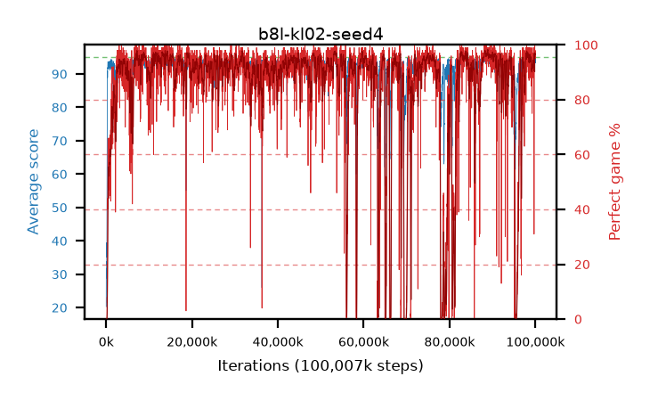

# b8l-kl02-seed4

step **100,007,936** · 6104 evals · trailing **94.33** · peak **94.63** @84,131,840 · sef **85.2** · best30 **97.2** @53,428,224

## Config

| | |
|---|---|
| algo | ppo |
| collect_envs | 128 |
| discount | 0.99 |
| eval_interval | 16384 |
| eval_queue | True |
| eval_queue_depth | 16 |
| eval_workers | 8 |
| fc_layers | (200, 100) |
| graph_eval_episodes | 100 |
| max_steps | 100007936 |
| min_checkpoint_score | 40.0 |
| ppo_adam_epsilon | 1e-07 |
| ppo_clip | 0.2 |
| ppo_entropy_coef | 0.01 |
| ppo_entropy_coef_final | None |
| ppo_epochs | 8 |
| ppo_gae_lambda | 0.98 |
| ppo_gradient_clipping | 0.5 |
| ppo_horizon | 33.6 |
| ppo_learning_rate | 0.0003 |
| ppo_minibatch | 256 |
| ppo_normalize_adv | True |
| ppo_rollout | 128 |
| ppo_target_kl | 0.02 |
| ppo_transitions_per_rollout | 16384 |
| ppo_value_loss | huber |
| ppo_vf_coef | 0.5 |
| seed | 4 |
| torch_threads | 1 |

## Evals

| step | avg score | trailing avg | min score | max score | avg reward | perfect % | epsilon |
|---|---|---|---|---|---|---|---|
| 16384 | 20.29 | 20.29 | 2.0 | 40.0 | 15.38 | 0.0 |  |
| 32768 | 31.74 | 26.02 | 10.0 | 59.0 | 26.83 | 0.0 |  |
| 49152 | 28.89 | 26.97 | 7.0 | 50.0 | 23.89 | 0.0 |  |
| ... | ... | ... | ... | ... | ... | ... | ... |
| 99827712 | 93.96 | 94.24 | 3.0 | 95.0 | 190.925 | 98.0 |  |
| 99844096 | 93.99 | 94.35 | 62.0 | 95.0 | 186.84 | 94.0 |  |
| 99860480 | 95.0 | 94.38 | 95.0 | 95.0 | 194.0 | 100.0 |  |
| 99876864 | 93.89 | 94.38 | 5.0 | 95.0 | 187.735 | 95.0 |  |
| 99893248 | 94.71 | 94.29 | 78.0 | 95.0 | 190.59 | 97.0 |  |
| 99909632 | 94.67 | 94.29 | 77.0 | 95.0 | 190.55 | 97.0 |  |
| 99926016 | 93.79 | 94.24 | 5.0 | 95.0 | 188.72 | 96.0 |  |
| 99942400 | 94.89 | 94.25 | 87.0 | 95.0 | 191.81 | 98.0 |  |
| 99958784 | 94.13 | 94.25 | 62.0 | 95.0 | 188.97 | 96.0 |  |
| 99975168 | 93.31 | 94.24 | 38.0 | 95.0 | 187.11 | 95.0 |  |
| 99991552 | 94.21 | 94.28 | 42.0 | 95.0 | 189.05 | 96.0 |  |
| 100007936 | 94.71 | 94.33 | 78.0 | 95.0 | 189.55 | 96.0 |  |
