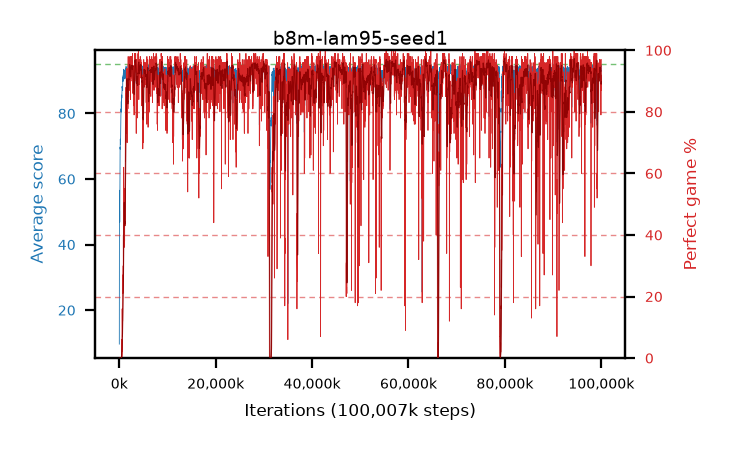

# b8m-lam95-seed1

step **100,007,936** · 6104 evals · trailing **93.95** · peak **94.49** @67,747,840 · sef **86.8** · best30 **96.2** @67,600,384

## Config

| | |
|---|---|
| algo | ppo |
| collect_envs | 128 |
| discount | 0.99 |
| eval_interval | 16384 |
| eval_queue | True |
| eval_queue_depth | 16 |
| eval_workers | 8 |
| fc_layers | (200, 100) |
| graph_eval_episodes | 100 |
| max_steps | 100007936 |
| min_checkpoint_score | 40.0 |
| ppo_adam_epsilon | 1e-07 |
| ppo_clip | 0.2 |
| ppo_entropy_coef | 0.01 |
| ppo_entropy_coef_final | None |
| ppo_epochs | 8 |
| ppo_gae_lambda | 0.95 |
| ppo_gradient_clipping | 0.5 |
| ppo_horizon | 16.8 |
| ppo_learning_rate | 0.0003 |
| ppo_minibatch | 256 |
| ppo_normalize_adv | True |
| ppo_rollout | 128 |
| ppo_target_kl | 0.0 |
| ppo_transitions_per_rollout | 16384 |
| ppo_value_loss | huber |
| ppo_vf_coef | 0.5 |
| seed | 1 |
| torch_threads | 1 |

## Evals

| step | avg score | trailing avg | min score | max score | avg reward | perfect % | epsilon |
|---|---|---|---|---|---|---|---|
| 16384 | 9.65 | 9.65 | 0.0 | 27.0 | 6.18 | 0.0 |  |
| 32768 | 29.9 | 35.05 | 2.0 | 70.0 | 26.385 | 0.0 |  |
| 49152 | 56.58 | 40.6 | 17.0 | 82.0 | 51.715 | 0.0 |  |
| ... | ... | ... | ... | ... | ... | ... | ... |
| 99827712 | 94.17 | 93.95 | 79.0 | 95.0 | 183.81 | 91.0 |  |
| 99844096 | 94.5 | 93.84 | 76.0 | 95.0 | 188.3 | 95.0 |  |
| 99860480 | 94.7 | 93.84 | 86.0 | 95.0 | 188.5 | 95.0 |  |
| 99876864 | 94.07 | 93.98 | 80.0 | 95.0 | 181.63 | 89.0 |  |
| 99893248 | 94.05 | 93.83 | 74.0 | 95.0 | 184.73 | 92.0 |  |
| 99909632 | 92.7 | 93.96 | 39.0 | 95.0 | 175.195 | 84.0 |  |
| 99926016 | 93.39 | 93.99 | 79.0 | 95.0 | 170.595 | 79.0 |  |
| 99942400 | 93.64 | 93.98 | 70.0 | 95.0 | 181.29 | 89.0 |  |
| 99958784 | 92.93 | 94.0 | 9.0 | 95.0 | 178.41 | 87.0 |  |
| 99975168 | 94.33 | 93.95 | 81.0 | 95.0 | 185.01 | 92.0 |  |
| 99991552 | 94.27 | 93.99 | 73.0 | 95.0 | 185.99 | 93.0 |  |
| 100007936 | 94.66 | 93.95 | 77.0 | 95.0 | 190.54 | 97.0 |  |
