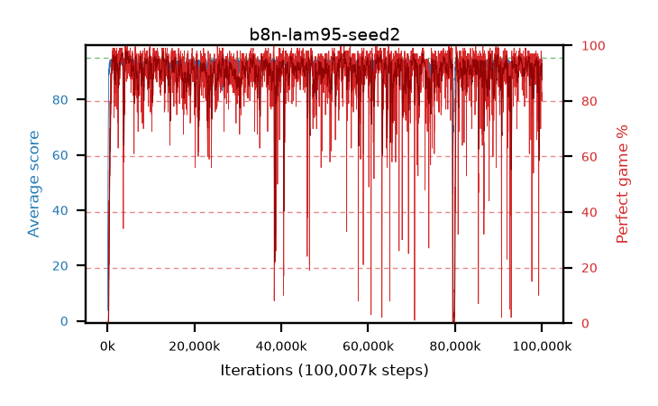

# b8n-lam95-seed2

step **100,007,936** · 6104 evals · trailing **93.06** · peak **94.39** @78,938,112 · sef **91.0** · best30 **96.5** @3,473,408

## Config

| | |
|---|---|
| algo | ppo |
| collect_envs | 128 |
| discount | 0.99 |
| eval_interval | 16384 |
| eval_queue | True |
| eval_queue_depth | 16 |
| eval_workers | 8 |
| fc_layers | (200, 100) |
| graph_eval_episodes | 100 |
| max_steps | 100007936 |
| min_checkpoint_score | 40.0 |
| ppo_adam_epsilon | 1e-07 |
| ppo_clip | 0.2 |
| ppo_entropy_coef | 0.01 |
| ppo_entropy_coef_final | None |
| ppo_epochs | 8 |
| ppo_gae_lambda | 0.95 |
| ppo_gradient_clipping | 0.5 |
| ppo_horizon | 16.8 |
| ppo_learning_rate | 0.0003 |
| ppo_minibatch | 256 |
| ppo_normalize_adv | True |
| ppo_rollout | 128 |
| ppo_target_kl | 0.0 |
| ppo_transitions_per_rollout | 16384 |
| ppo_value_loss | huber |
| ppo_vf_coef | 0.5 |
| seed | 2 |
| torch_threads | 1 |

## Evals

| step | avg score | trailing avg | min score | max score | avg reward | perfect % | epsilon |
|---|---|---|---|---|---|---|---|
| 16384 | 3.76 | 3.76 | 0.0 | 15.0 | -1.15 | 0.0 |  |
| 32768 | 18.07 | 10.91 | 1.0 | 39.0 | 14.69 | 0.0 |  |
| 49152 | 30.01 | 17.28 | 10.0 | 52.0 | 25.01 | 0.0 |  |
| ... | ... | ... | ... | ... | ... | ... | ... |
| 99827712 | 92.55 | 92.74 | 9.0 | 95.0 | 184.315 | 93.0 |  |
| 99844096 | 94.36 | 92.93 | 49.0 | 95.0 | 189.245 | 96.0 |  |
| 99860480 | 93.51 | 93.16 | 73.0 | 95.0 | 179.395 | 87.0 |  |
| 99876864 | 94.28 | 93.22 | 76.0 | 95.0 | 184.01 | 91.0 |  |
| 99893248 | 93.52 | 93.19 | 30.0 | 95.0 | 187.365 | 95.0 |  |
| 99909632 | 94.59 | 93.2 | 79.0 | 95.0 | 188.39 | 95.0 |  |
| 99926016 | 93.57 | 93.19 | 70.0 | 95.0 | 182.53 | 90.0 |  |
| 99942400 | 93.84 | 93.19 | 76.0 | 95.0 | 180.72 | 88.0 |  |
| 99958784 | 93.41 | 93.22 | 69.0 | 95.0 | 178.21 | 86.0 |  |
| 99975168 | 92.9 | 93.15 | 76.0 | 95.0 | 172.59 | 81.0 |  |
| 99991552 | 92.54 | 93.11 | 65.0 | 95.0 | 171.28 | 80.0 |  |
| 100007936 | 92.25 | 93.06 | 66.0 | 95.0 | 174.11 | 83.0 |  |
