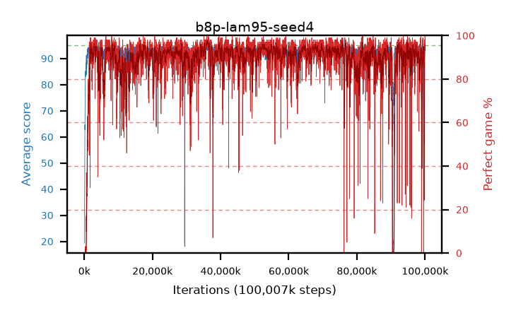

# b8p-lam95-seed4

step **100,007,936** · 6104 evals · trailing **90.69** · peak **94.39** @36,470,784 · sef **90.3** · best30 **96.9** @36,306,944

## Config

| | |
|---|---|
| algo | ppo |
| collect_envs | 128 |
| discount | 0.99 |
| eval_interval | 16384 |
| eval_queue | True |
| eval_queue_depth | 16 |
| eval_workers | 8 |
| fc_layers | (200, 100) |
| graph_eval_episodes | 100 |
| max_steps | 100007936 |
| min_checkpoint_score | 40.0 |
| ppo_adam_epsilon | 1e-07 |
| ppo_clip | 0.2 |
| ppo_entropy_coef | 0.01 |
| ppo_entropy_coef_final | None |
| ppo_epochs | 8 |
| ppo_gae_lambda | 0.95 |
| ppo_gradient_clipping | 0.5 |
| ppo_horizon | 16.8 |
| ppo_learning_rate | 0.0003 |
| ppo_minibatch | 256 |
| ppo_normalize_adv | True |
| ppo_rollout | 128 |
| ppo_target_kl | 0.0 |
| ppo_transitions_per_rollout | 16384 |
| ppo_value_loss | huber |
| ppo_vf_coef | 0.5 |
| seed | 4 |
| torch_threads | 1 |

## Evals

| step | avg score | trailing avg | min score | max score | avg reward | perfect % | epsilon |
|---|---|---|---|---|---|---|---|
| 16384 | 19.31 | 19.31 | 0.0 | 41.0 | 14.58 | 0.0 |  |
| 32768 | 29.9 | 24.6 | 2.0 | 56.0 | 24.99 | 0.0 |  |
| 49152 | 31.92 | 27.04 | 11.0 | 52.0 | 26.965 | 0.0 |  |
| ... | ... | ... | ... | ... | ... | ... | ... |
| 99827712 | 93.81 | 90.67 | 66.0 | 95.0 | 181.37 | 89.0 |  |
| 99844096 | 94.0 | 90.66 | 47.0 | 95.0 | 186.805 | 94.0 |  |
| 99860480 | 94.49 | 90.73 | 47.0 | 95.0 | 191.41 | 98.0 |  |
| 99876864 | 93.06 | 90.7 | 32.0 | 95.0 | 183.74 | 92.0 |  |
| 99893248 | 94.65 | 90.67 | 81.0 | 95.0 | 189.535 | 96.0 |  |
| 99909632 | 94.08 | 90.67 | 70.0 | 95.0 | 188.015 | 95.0 |  |
| 99926016 | 94.63 | 90.67 | 77.0 | 95.0 | 187.435 | 94.0 |  |
| 99942400 | 94.18 | 90.66 | 70.0 | 95.0 | 188.025 | 95.0 |  |
| 99958784 | 94.55 | 90.66 | 67.0 | 95.0 | 191.515 | 98.0 |  |
| 99975168 | 94.68 | 90.66 | 85.0 | 95.0 | 186.4 | 93.0 |  |
| 99991552 | 95.0 | 90.69 | 95.0 | 95.0 | 194.0 | 100.0 |  |
| 100007936 | 94.74 | 90.69 | 84.0 | 95.0 | 189.58 | 96.0 |  |
