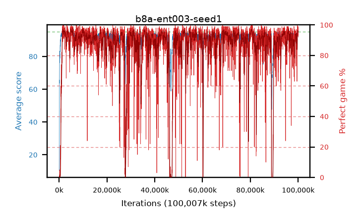

# b8a-ent003-seed1

step **100,007,936** · 6104 evals · trailing **93.39** · peak **94.44** @80,642,048 · sef **85.0** · best30 **96.7** @80,674,816

## Config

| | |
|---|---|
| algo | ppo |
| collect_envs | 128 |
| discount | 0.99 |
| eval_interval | 16384 |
| eval_queue | True |
| eval_queue_depth | 16 |
| eval_workers | 8 |
| fc_layers | (200, 100) |
| graph_eval_episodes | 100 |
| max_steps | 100007936 |
| min_checkpoint_score | 40.0 |
| ppo_adam_epsilon | 1e-07 |
| ppo_clip | 0.2 |
| ppo_entropy_coef | 0.003 |
| ppo_entropy_coef_final | None |
| ppo_epochs | 8 |
| ppo_gae_lambda | 0.98 |
| ppo_gradient_clipping | 0.5 |
| ppo_horizon | 33.6 |
| ppo_learning_rate | 0.0003 |
| ppo_minibatch | 256 |
| ppo_normalize_adv | True |
| ppo_rollout | 128 |
| ppo_target_kl | 0.0 |
| ppo_transitions_per_rollout | 16384 |
| ppo_value_loss | huber |
| ppo_vf_coef | 0.5 |
| seed | 1 |
| torch_threads | 1 |

## Evals

| step | avg score | trailing avg | min score | max score | avg reward | perfect % | epsilon |
|---|---|---|---|---|---|---|---|
| 16384 | 10.39 | 10.39 | 3.0 | 23.0 | 5.975 | 0.0 |  |
| 32768 | 21.75 | 16.07 | 3.0 | 49.0 | 18.145 | 0.0 |  |
| 49152 | 26.42 | 19.52 | 5.0 | 55.0 | 21.51 | 0.0 |  |
| ... | ... | ... | ... | ... | ... | ... | ... |
| 99827712 | 93.51 | 93.26 | 7.0 | 95.0 | 186.36 | 94.0 |  |
| 99844096 | 94.57 | 93.7 | 71.0 | 95.0 | 189.41 | 96.0 |  |
| 99860480 | 94.31 | 93.82 | 68.0 | 95.0 | 188.2 | 95.0 |  |
| 99876864 | 93.75 | 93.09 | 10.0 | 95.0 | 188.59 | 96.0 |  |
| 99893248 | 94.88 | 93.11 | 86.0 | 95.0 | 191.8 | 98.0 |  |
| 99909632 | 93.05 | 93.17 | 15.0 | 95.0 | 184.815 | 93.0 |  |
| 99926016 | 94.48 | 93.25 | 75.0 | 95.0 | 190.405 | 97.0 |  |
| 99942400 | 94.92 | 93.39 | 87.0 | 95.0 | 192.88 | 99.0 |  |
| 99958784 | 94.09 | 93.29 | 66.0 | 95.0 | 185.855 | 93.0 |  |
| 99975168 | 93.98 | 93.53 | 12.0 | 95.0 | 188.865 | 96.0 |  |
| 99991552 | 94.66 | 93.33 | 78.0 | 95.0 | 190.54 | 97.0 |  |
| 100007936 | 94.26 | 93.39 | 82.0 | 95.0 | 184.94 | 92.0 |  |
