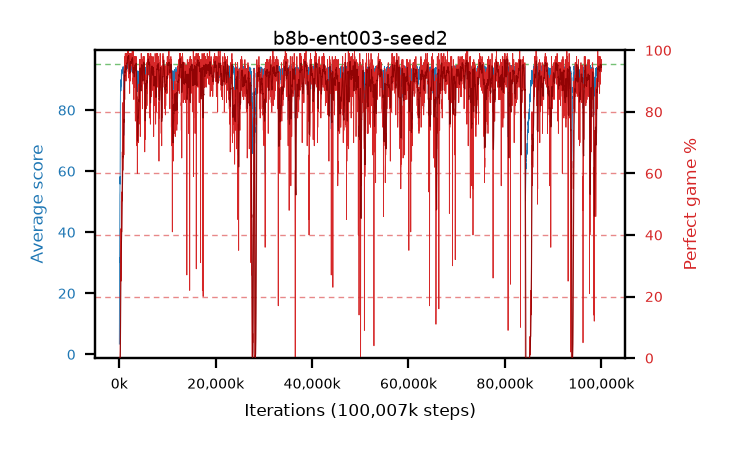

# b8b-ent003-seed2

step **100,007,936** · 6104 evals · trailing **94.05** · peak **94.3** @83,148,800 · sef **86.7** · best30 **97.3** @1,949,696

## Config

| | |
|---|---|
| algo | ppo |
| collect_envs | 128 |
| discount | 0.99 |
| eval_interval | 16384 |
| eval_queue | True |
| eval_queue_depth | 16 |
| eval_workers | 8 |
| fc_layers | (200, 100) |
| graph_eval_episodes | 100 |
| max_steps | 100007936 |
| min_checkpoint_score | 40.0 |
| ppo_adam_epsilon | 1e-07 |
| ppo_clip | 0.2 |
| ppo_entropy_coef | 0.003 |
| ppo_entropy_coef_final | None |
| ppo_epochs | 8 |
| ppo_gae_lambda | 0.98 |
| ppo_gradient_clipping | 0.5 |
| ppo_horizon | 33.6 |
| ppo_learning_rate | 0.0003 |
| ppo_minibatch | 256 |
| ppo_normalize_adv | True |
| ppo_rollout | 128 |
| ppo_target_kl | 0.0 |
| ppo_transitions_per_rollout | 16384 |
| ppo_value_loss | huber |
| ppo_vf_coef | 0.5 |
| seed | 2 |
| torch_threads | 1 |

## Evals

| step | avg score | trailing avg | min score | max score | avg reward | perfect % | epsilon |
|---|---|---|---|---|---|---|---|
| 16384 | 3.36 | 3.36 | 1.0 | 12.0 | -1.64 | 0.0 |  |
| 32768 | 15.27 | 9.31 | 1.0 | 41.0 | 12.745 | 0.0 |  |
| 49152 | 30.83 | 16.49 | 6.0 | 54.0 | 25.83 | 0.0 |  |
| ... | ... | ... | ... | ... | ... | ... | ... |
| 99827712 | 93.41 | 93.93 | 59.0 | 95.0 | 181.015 | 89.0 |  |
| 99844096 | 94.42 | 93.92 | 77.0 | 95.0 | 186.185 | 93.0 |  |
| 99860480 | 92.9 | 93.93 | 5.0 | 95.0 | 184.71 | 93.0 |  |
| 99876864 | 94.5 | 93.95 | 73.0 | 95.0 | 189.43 | 96.0 |  |
| 99893248 | 92.65 | 93.92 | 1.0 | 95.0 | 187.625 | 96.0 |  |
| 99909632 | 93.97 | 93.95 | 4.0 | 95.0 | 189.895 | 97.0 |  |
| 99926016 | 94.64 | 94.02 | 77.0 | 95.0 | 189.525 | 96.0 |  |
| 99942400 | 93.84 | 93.94 | 10.0 | 95.0 | 185.695 | 93.0 |  |
| 99958784 | 94.73 | 93.97 | 72.0 | 95.0 | 190.61 | 97.0 |  |
| 99975168 | 94.05 | 93.95 | 44.0 | 95.0 | 186.9 | 94.0 |  |
| 99991552 | 94.08 | 93.9 | 42.0 | 95.0 | 188.92 | 96.0 |  |
| 100007936 | 93.96 | 94.05 | 12.0 | 95.0 | 187.895 | 95.0 |  |
