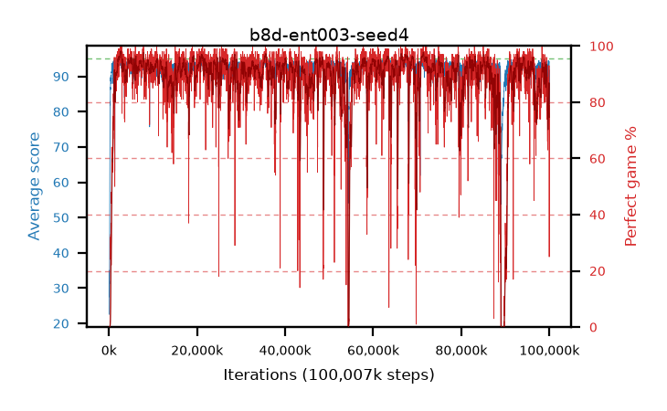

# b8d-ent003-seed4

step **100,007,936** · 6104 evals · trailing **91.82** · peak **94.42** @66,715,648 · sef **88.5** · best30 **97.4** @2,768,896

## Config

| | |
|---|---|
| algo | ppo |
| collect_envs | 128 |
| discount | 0.99 |
| eval_interval | 16384 |
| eval_queue | True |
| eval_queue_depth | 16 |
| eval_workers | 8 |
| fc_layers | (200, 100) |
| graph_eval_episodes | 100 |
| max_steps | 100007936 |
| min_checkpoint_score | 40.0 |
| ppo_adam_epsilon | 1e-07 |
| ppo_clip | 0.2 |
| ppo_entropy_coef | 0.003 |
| ppo_entropy_coef_final | None |
| ppo_epochs | 8 |
| ppo_gae_lambda | 0.98 |
| ppo_gradient_clipping | 0.5 |
| ppo_horizon | 33.6 |
| ppo_learning_rate | 0.0003 |
| ppo_minibatch | 256 |
| ppo_normalize_adv | True |
| ppo_rollout | 128 |
| ppo_target_kl | 0.0 |
| ppo_transitions_per_rollout | 16384 |
| ppo_value_loss | huber |
| ppo_vf_coef | 0.5 |
| seed | 4 |
| torch_threads | 1 |

## Evals

| step | avg score | trailing avg | min score | max score | avg reward | perfect % | epsilon |
|---|---|---|---|---|---|---|---|
| 16384 | 22.58 | 22.58 | 4.0 | 40.0 | 17.58 | 0.0 |  |
| 32768 | 35.02 | 28.6 | 15.0 | 65.0 | 30.02 | 0.0 |  |
| 49152 | 27.56 | 25.07 | 3.0 | 48.0 | 22.56 | 0.0 |  |
| ... | ... | ... | ... | ... | ... | ... | ... |
| 99827712 | 93.64 | 91.72 | 80.0 | 95.0 | 175.005 | 83.0 |  |
| 99844096 | 93.73 | 91.7 | 14.0 | 95.0 | 182.42 | 90.0 |  |
| 99860480 | 93.02 | 91.7 | 66.0 | 95.0 | 175.38 | 84.0 |  |
| 99876864 | 93.87 | 91.82 | 72.0 | 95.0 | 180.39 | 88.0 |  |
| 99893248 | 93.96 | 91.93 | 78.0 | 95.0 | 182.605 | 90.0 |  |
| 99909632 | 94.01 | 91.9 | 66.0 | 95.0 | 182.655 | 90.0 |  |
| 99926016 | 94.22 | 91.96 | 66.0 | 95.0 | 185.985 | 93.0 |  |
| 99942400 | 89.96 | 91.88 | 32.0 | 95.0 | 150.48 | 63.0 |  |
| 99958784 | 82.14 | 91.51 | 3.0 | 95.0 | 103.185 | 25.0 |  |
| 99975168 | 89.63 | 91.42 | 51.0 | 95.0 | 147.03 | 60.0 |  |
| 99991552 | 91.18 | 91.4 | 12.0 | 95.0 | 168.34 | 79.0 |  |
| 100007936 | 91.75 | 91.82 | 61.0 | 95.0 | 163.71 | 74.0 |  |
