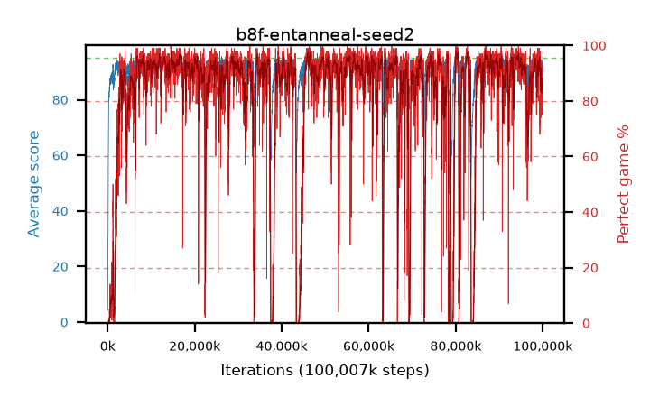

# b8f-entanneal-seed2

step **100,007,936** · 6104 evals · trailing **91.31** · peak **94.65** @80,379,904 · sef **80.1** · best30 **96.8** @80,396,288

## Config

| | |
|---|---|
| algo | ppo |
| collect_envs | 128 |
| discount | 0.99 |
| eval_interval | 16384 |
| eval_queue | True |
| eval_queue_depth | 16 |
| eval_workers | 8 |
| fc_layers | (200, 100) |
| graph_eval_episodes | 100 |
| max_steps | 100007936 |
| min_checkpoint_score | 40.0 |
| ppo_adam_epsilon | 1e-07 |
| ppo_clip | 0.2 |
| ppo_entropy_coef | 0.01 |
| ppo_entropy_coef_final | 0.001 |
| ppo_epochs | 8 |
| ppo_gae_lambda | 0.98 |
| ppo_gradient_clipping | 0.5 |
| ppo_horizon | 33.6 |
| ppo_learning_rate | 0.0003 |
| ppo_minibatch | 256 |
| ppo_normalize_adv | True |
| ppo_rollout | 128 |
| ppo_target_kl | 0.0 |
| ppo_transitions_per_rollout | 16384 |
| ppo_value_loss | huber |
| ppo_vf_coef | 0.5 |
| seed | 2 |
| torch_threads | 1 |

## Evals

| step | avg score | trailing avg | min score | max score | avg reward | perfect % | epsilon |
|---|---|---|---|---|---|---|---|
| 16384 | 4.16 | 4.16 | 1.0 | 16.0 | -0.84 | 0.0 |  |
| 32768 | 19.27 | 17.4 | 1.0 | 44.0 | 15.71 | 0.0 |  |
| 49152 | 28.77 | 16.46 | 11.0 | 51.0 | 23.77 | 0.0 |  |
| ... | ... | ... | ... | ... | ... | ... | ... |
| 99827712 | 92.08 | 91.85 | 23.0 | 95.0 | 178.645 | 88.0 |  |
| 99844096 | 91.97 | 91.89 | 3.0 | 95.0 | 180.705 | 90.0 |  |
| 99860480 | 92.39 | 91.93 | 1.0 | 95.0 | 174.795 | 84.0 |  |
| 99876864 | 91.62 | 91.59 | 15.0 | 95.0 | 172.94 | 83.0 |  |
| 99893248 | 90.43 | 91.5 | 5.0 | 95.0 | 163.52 | 75.0 |  |
| 99909632 | 91.17 | 91.86 | 40.0 | 95.0 | 173.53 | 84.0 |  |
| 99926016 | 90.29 | 91.66 | 7.0 | 95.0 | 171.655 | 83.0 |  |
| 99942400 | 91.9 | 91.81 | 9.0 | 95.0 | 182.625 | 92.0 |  |
| 99958784 | 89.67 | 91.36 | 3.0 | 95.0 | 175.33 | 87.0 |  |
| 99975168 | 91.42 | 91.26 | 1.0 | 95.0 | 173.87 | 84.0 |  |
| 99991552 | 93.91 | 91.3 | 9.0 | 95.0 | 188.795 | 96.0 |  |
| 100007936 | 92.07 | 91.31 | 7.0 | 95.0 | 184.92 | 94.0 |  |
