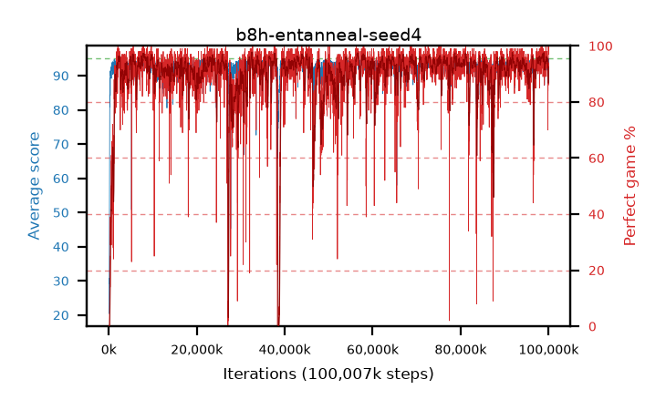

# b8h-entanneal-seed4

step **100,007,936** · 6104 evals · trailing **93.36** · peak **94.42** @98,615,296 · sef **90.9** · best30 **96.8** @8,142,848

## Config

| | |
|---|---|
| algo | ppo |
| collect_envs | 128 |
| discount | 0.99 |
| eval_interval | 16384 |
| eval_queue | True |
| eval_queue_depth | 16 |
| eval_workers | 8 |
| fc_layers | (200, 100) |
| graph_eval_episodes | 100 |
| max_steps | 100007936 |
| min_checkpoint_score | 40.0 |
| ppo_adam_epsilon | 1e-07 |
| ppo_clip | 0.2 |
| ppo_entropy_coef | 0.01 |
| ppo_entropy_coef_final | 0.001 |
| ppo_epochs | 8 |
| ppo_gae_lambda | 0.98 |
| ppo_gradient_clipping | 0.5 |
| ppo_horizon | 33.6 |
| ppo_learning_rate | 0.0003 |
| ppo_minibatch | 256 |
| ppo_normalize_adv | True |
| ppo_rollout | 128 |
| ppo_target_kl | 0.0 |
| ppo_transitions_per_rollout | 16384 |
| ppo_value_loss | huber |
| ppo_vf_coef | 0.5 |
| seed | 4 |
| torch_threads | 1 |

## Evals

| step | avg score | trailing avg | min score | max score | avg reward | perfect % | epsilon |
|---|---|---|---|---|---|---|---|
| 16384 | 20.44 | 20.44 | 0.0 | 38.0 | 15.575 | 0.0 |  |
| 32768 | 28.83 | 24.63 | 4.0 | 48.0 | 23.92 | 0.0 |  |
| 49152 | 29.66 | 26.31 | 9.0 | 59.0 | 24.66 | 0.0 |  |
| ... | ... | ... | ... | ... | ... | ... | ... |
| 99827712 | 89.95 | 93.81 | 5.0 | 95.0 | 157.93 | 70.0 |  |
| 99844096 | 92.36 | 93.94 | 17.0 | 95.0 | 174.04 | 83.0 |  |
| 99860480 | 90.32 | 93.65 | 8.0 | 95.0 | 172.86 | 84.0 |  |
| 99876864 | 89.64 | 93.43 | 14.0 | 95.0 | 172.315 | 84.0 |  |
| 99893248 | 92.9 | 93.27 | 19.0 | 95.0 | 180.685 | 89.0 |  |
| 99909632 | 93.35 | 93.6 | 8.0 | 95.0 | 186.11 | 94.0 |  |
| 99926016 | 89.55 | 93.27 | 3.0 | 95.0 | 174.26 | 86.0 |  |
| 99942400 | 93.82 | 93.31 | 16.0 | 95.0 | 185.675 | 93.0 |  |
| 99958784 | 95.0 | 93.33 | 95.0 | 95.0 | 194.0 | 100.0 |  |
| 99975168 | 93.31 | 93.25 | 7.0 | 95.0 | 190.275 | 98.0 |  |
| 99991552 | 94.47 | 93.25 | 51.0 | 95.0 | 190.44 | 97.0 |  |
| 100007936 | 95.0 | 93.36 | 95.0 | 95.0 | 194.0 | 100.0 |  |
