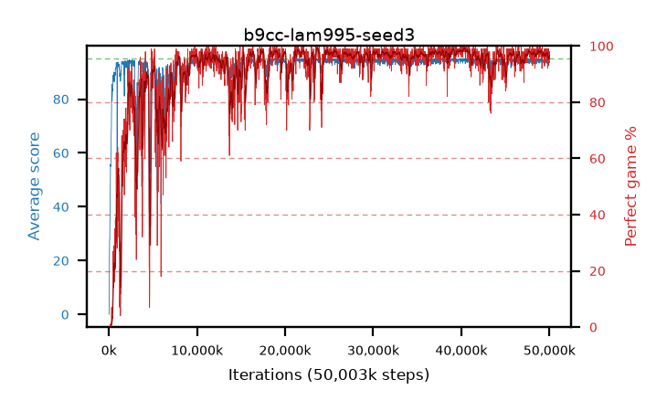

# b9cc-lam995-seed3

step **50,003,968** · 3052 evals · trailing **94.02** · peak **94.69** @39,157,760 · sef **89.7** · best30 **98.8** @40,419,328

## Config

| | |
|---|---|
| algo | ppo |
| collect_envs | 128 |
| discount | 0.99 |
| eval_interval | 16384 |
| eval_queue | True |
| eval_queue_depth | 16 |
| eval_workers | 8 |
| fc_layers | (320,) |
| graph_eval_episodes | 100 |
| max_steps | 50003968 |
| min_checkpoint_score | 40.0 |
| ppo_adam_epsilon | 1e-07 |
| ppo_clip | 0.2 |
| ppo_clip_final | None |
| ppo_entropy_coef | 0.01 |
| ppo_entropy_coef_final | None |
| ppo_epochs | 4 |
| ppo_gae_lambda | 0.995 |
| ppo_gradient_clipping | 0.5 |
| ppo_horizon | 66.9 |
| ppo_learning_rate | 0.0003 |
| ppo_learning_rate_final | None |
| ppo_minibatch | 256 |
| ppo_normalize_adv | True |
| ppo_rollout | 128 |
| ppo_target_kl | 0.0 |
| ppo_transitions_per_rollout | 16384 |
| ppo_value_loss | huber |
| ppo_vf_coef | 0.5 |
| seed | 3 |
| torch_threads | 1 |

## Evals

| step | avg score | trailing avg | min score | max score | avg reward | perfect % | epsilon |
|---|---|---|---|---|---|---|---|
| 16384 | 0.05 | 0.05 | 0.0 | 1.0 | -4.14 | 0.0 |  |
| 32768 | 1.53 | 0.79 | 0.0 | 6.0 | 0.76 | 0.0 |  |
| 49152 | 15.76 | 5.78 | 0.0 | 29.0 | 11.255 | 0.0 |  |
| ... | ... | ... | ... | ... | ... | ... | ... |
| 49823744 | 93.66 | 94.13 | 56.0 | 95.0 | 186.645 | 94.0 |  |
| 49840128 | 92.91 | 94.11 | 14.0 | 95.0 | 184.945 | 93.0 |  |
| 49856512 | 94.45 | 94.04 | 54.0 | 95.0 | 189.47 | 96.0 |  |
| 49872896 | 94.16 | 94.02 | 16.0 | 95.0 | 191.17 | 98.0 |  |
| 49889280 | 92.8 | 94.01 | 3.0 | 95.0 | 184.835 | 93.0 |  |
| 49905664 | 93.1 | 94.03 | 6.0 | 95.0 | 188.12 | 96.0 |  |
| 49922048 | 94.98 | 94.05 | 93.0 | 95.0 | 192.985 | 99.0 |  |
| 49938432 | 94.15 | 94.04 | 18.0 | 95.0 | 190.12 | 97.0 |  |
| 49954816 | 94.51 | 94.01 | 55.0 | 95.0 | 191.52 | 98.0 |  |
| 49971200 | 94.05 | 94.02 | 24.0 | 95.0 | 190.02 | 97.0 |  |
| 49987584 | 93.44 | 94.05 | 3.0 | 95.0 | 187.465 | 95.0 |  |
| 50003968 | 93.92 | 94.02 | 16.0 | 95.0 | 190.885 | 98.0 |  |
