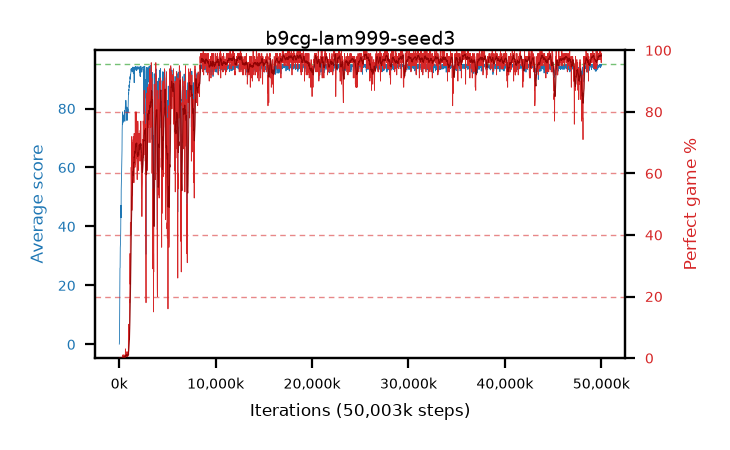

# b9cg-lam999-seed3

step **50,003,968** · 3052 evals · trailing **94.44** · peak **94.57** @29,442,048 · sef **89.3** · best30 **98.1** @25,788,416

## Config

| | |
|---|---|
| algo | ppo |
| collect_envs | 128 |
| discount | 0.99 |
| eval_interval | 16384 |
| eval_queue | True |
| eval_queue_depth | 16 |
| eval_workers | 8 |
| fc_layers | (320,) |
| graph_eval_episodes | 100 |
| max_steps | 50003968 |
| min_checkpoint_score | 40.0 |
| ppo_adam_epsilon | 1e-07 |
| ppo_clip | 0.2 |
| ppo_clip_final | None |
| ppo_entropy_coef | 0.01 |
| ppo_entropy_coef_final | None |
| ppo_epochs | 4 |
| ppo_gae_lambda | 0.999 |
| ppo_gradient_clipping | 0.5 |
| ppo_horizon | 91.0 |
| ppo_learning_rate | 0.0003 |
| ppo_learning_rate_final | None |
| ppo_minibatch | 256 |
| ppo_normalize_adv | True |
| ppo_rollout | 128 |
| ppo_target_kl | 0.0 |
| ppo_transitions_per_rollout | 16384 |
| ppo_value_loss | huber |
| ppo_vf_coef | 0.5 |
| seed | 3 |
| torch_threads | 1 |

## Evals

| step | avg score | trailing avg | min score | max score | avg reward | perfect % | epsilon |
|---|---|---|---|---|---|---|---|
| 16384 | 0.09 | 0.09 | 0.0 | 2.0 | -4.37 | 0.0 |  |
| 32768 | 1.23 | 0.66 | 0.0 | 5.0 | 0.73 | 0.0 |  |
| 49152 | 10.83 | 4.05 | 3.0 | 26.0 | 7.045 | 0.0 |  |
| ... | ... | ... | ... | ... | ... | ... | ... |
| 49823744 | 94.83 | 94.3 | 86.0 | 95.0 | 191.84 | 98.0 |  |
| 49840128 | 95.0 | 94.02 | 95.0 | 95.0 | 194.0 | 100.0 |  |
| 49856512 | 94.25 | 94.08 | 56.0 | 95.0 | 190.265 | 97.0 |  |
| 49872896 | 94.94 | 94.07 | 89.0 | 95.0 | 192.945 | 99.0 |  |
| 49889280 | 94.18 | 94.04 | 57.0 | 95.0 | 190.195 | 97.0 |  |
| 49905664 | 93.84 | 94.06 | 36.0 | 95.0 | 189.81 | 97.0 |  |
| 49922048 | 95.0 | 94.34 | 95.0 | 95.0 | 194.0 | 100.0 |  |
| 49938432 | 95.0 | 94.14 | 95.0 | 95.0 | 194.0 | 100.0 |  |
| 49954816 | 94.11 | 94.16 | 6.0 | 95.0 | 192.115 | 99.0 |  |
| 49971200 | 94.81 | 94.23 | 83.0 | 95.0 | 191.82 | 98.0 |  |
| 49987584 | 94.55 | 94.37 | 70.0 | 95.0 | 189.57 | 96.0 |  |
| 50003968 | 94.95 | 94.44 | 90.0 | 95.0 | 192.955 | 99.0 |  |
