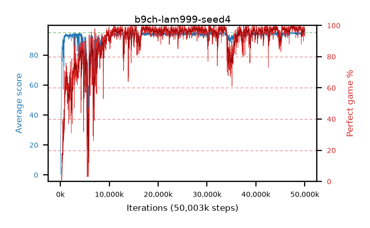

# b9ch-lam999-seed4

step **50,003,968** · 3052 evals · trailing **94.44** · peak **94.86** @47,661,056 · sef **86.5** · best30 **99.0** @47,529,984

## Config

| | |
|---|---|
| algo | ppo |
| collect_envs | 128 |
| discount | 0.99 |
| eval_interval | 16384 |
| eval_queue | True |
| eval_queue_depth | 16 |
| eval_workers | 8 |
| fc_layers | (320,) |
| graph_eval_episodes | 100 |
| max_steps | 50003968 |
| min_checkpoint_score | 40.0 |
| ppo_adam_epsilon | 1e-07 |
| ppo_clip | 0.2 |
| ppo_clip_final | None |
| ppo_entropy_coef | 0.01 |
| ppo_entropy_coef_final | None |
| ppo_epochs | 4 |
| ppo_gae_lambda | 0.999 |
| ppo_gradient_clipping | 0.5 |
| ppo_horizon | 91.0 |
| ppo_learning_rate | 0.0003 |
| ppo_learning_rate_final | None |
| ppo_minibatch | 256 |
| ppo_normalize_adv | True |
| ppo_rollout | 128 |
| ppo_target_kl | 0.0 |
| ppo_transitions_per_rollout | 16384 |
| ppo_value_loss | huber |
| ppo_vf_coef | 0.5 |
| seed | 4 |
| torch_threads | 1 |

## Evals

| step | avg score | trailing avg | min score | max score | avg reward | perfect % | epsilon |
|---|---|---|---|---|---|---|---|
| 16384 | 0.4 | 0.4 | 0.0 | 2.0 | -1.45 | 0.0 |  |
| 32768 | 16.45 | 13.63 | 2.0 | 30.0 | 11.495 | 0.0 |  |
| 49152 | 24.04 | 12.22 | 10.0 | 42.0 | 19.04 | 0.0 |  |
| ... | ... | ... | ... | ... | ... | ... | ... |
| 49823744 | 94.88 | 94.38 | 83.0 | 95.0 | 192.885 | 99.0 |  |
| 49840128 | 95.0 | 94.35 | 95.0 | 95.0 | 194.0 | 100.0 |  |
| 49856512 | 94.69 | 94.38 | 79.0 | 95.0 | 190.705 | 97.0 |  |
| 49872896 | 94.82 | 94.41 | 79.0 | 95.0 | 191.83 | 98.0 |  |
| 49889280 | 93.69 | 94.38 | 10.0 | 95.0 | 189.705 | 97.0 |  |
| 49905664 | 94.91 | 94.41 | 86.0 | 95.0 | 192.915 | 99.0 |  |
| 49922048 | 94.96 | 94.45 | 91.0 | 95.0 | 192.965 | 99.0 |  |
| 49938432 | 94.74 | 94.39 | 78.0 | 95.0 | 191.75 | 98.0 |  |
| 49954816 | 94.23 | 94.39 | 70.0 | 95.0 | 188.255 | 95.0 |  |
| 49971200 | 93.88 | 94.44 | 30.0 | 95.0 | 185.915 | 93.0 |  |
| 49987584 | 94.25 | 94.43 | 71.0 | 95.0 | 186.285 | 93.0 |  |
| 50003968 | 94.38 | 94.44 | 75.0 | 95.0 | 187.365 | 94.0 |  |
