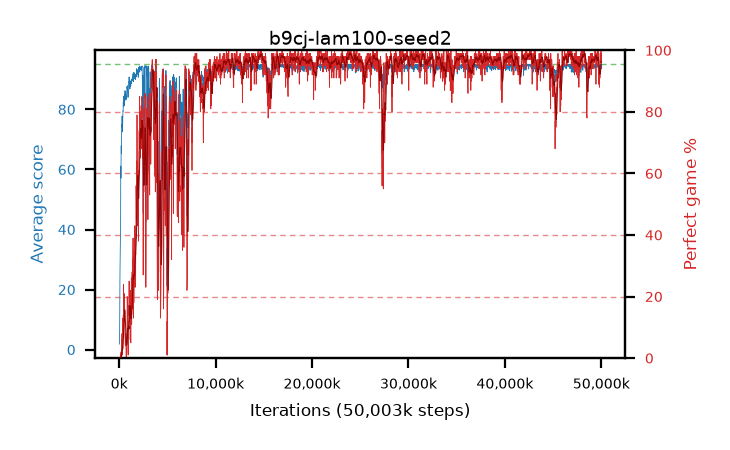

# b9cj-lam100-seed2

step **50,003,968** · 3052 evals · trailing **94.19** · peak **94.62** @42,500,096 · sef **87.8** · best30 **98.5** @42,696,704

## Config

| | |
|---|---|
| algo | ppo |
| collect_envs | 128 |
| discount | 0.99 |
| eval_interval | 16384 |
| eval_queue | True |
| eval_queue_depth | 16 |
| eval_workers | 8 |
| fc_layers | (320,) |
| graph_eval_episodes | 100 |
| max_steps | 50003968 |
| min_checkpoint_score | 40.0 |
| ppo_adam_epsilon | 1e-07 |
| ppo_clip | 0.2 |
| ppo_clip_final | None |
| ppo_entropy_coef | 0.01 |
| ppo_entropy_coef_final | None |
| ppo_epochs | 4 |
| ppo_gae_lambda | 1.0 |
| ppo_gradient_clipping | 0.5 |
| ppo_horizon | 100.0 |
| ppo_learning_rate | 0.0003 |
| ppo_learning_rate_final | None |
| ppo_minibatch | 256 |
| ppo_normalize_adv | True |
| ppo_rollout | 128 |
| ppo_target_kl | 0.0 |
| ppo_transitions_per_rollout | 16384 |
| ppo_value_loss | huber |
| ppo_vf_coef | 0.5 |
| seed | 2 |
| torch_threads | 1 |

## Evals

| step | avg score | trailing avg | min score | max score | avg reward | perfect % | epsilon |
|---|---|---|---|---|---|---|---|
| 16384 | 1.85 | 1.85 | 0.0 | 6.0 | -1.395 | 0.0 |  |
| 32768 | 2.64 | 2.25 | 0.0 | 9.0 | -2.045 | 0.0 |  |
| 49152 | 6.54 | 3.68 | 2.0 | 19.0 | 1.54 | 0.0 |  |
| ... | ... | ... | ... | ... | ... | ... | ... |
| 49823744 | 94.4 | 94.37 | 81.0 | 95.0 | 186.435 | 93.0 |  |
| 49840128 | 94.47 | 94.34 | 84.0 | 95.0 | 187.5 | 94.0 |  |
| 49856512 | 92.5 | 94.39 | 18.0 | 95.0 | 182.5 | 91.0 |  |
| 49872896 | 92.93 | 94.33 | 8.0 | 95.0 | 184.875 | 93.0 |  |
| 49889280 | 94.94 | 94.37 | 89.0 | 95.0 | 192.945 | 99.0 |  |
| 49905664 | 92.84 | 94.24 | 22.0 | 95.0 | 187.815 | 96.0 |  |
| 49922048 | 92.99 | 94.2 | 13.0 | 95.0 | 187.92 | 96.0 |  |
| 49938432 | 94.13 | 94.31 | 8.0 | 95.0 | 192.135 | 99.0 |  |
| 49954816 | 94.52 | 94.27 | 78.0 | 95.0 | 189.54 | 96.0 |  |
| 49971200 | 95.0 | 94.18 | 95.0 | 95.0 | 194.0 | 100.0 |  |
| 49987584 | 93.58 | 94.16 | 20.0 | 95.0 | 188.6 | 96.0 |  |
| 50003968 | 94.81 | 94.19 | 81.0 | 95.0 | 191.82 | 98.0 |  |
