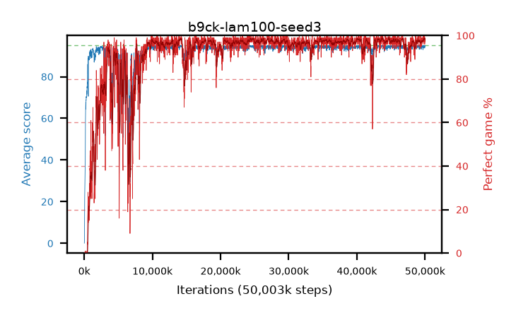

# b9ck-lam100-seed3

step **50,003,968** · 3052 evals · trailing **94.44** · peak **94.62** @24,674,304 · sef **89.3** · best30 **98.4** @24,821,760

## Config

| | |
|---|---|
| algo | ppo |
| collect_envs | 128 |
| discount | 0.99 |
| eval_interval | 16384 |
| eval_queue | True |
| eval_queue_depth | 16 |
| eval_workers | 8 |
| fc_layers | (320,) |
| graph_eval_episodes | 100 |
| max_steps | 50003968 |
| min_checkpoint_score | 40.0 |
| ppo_adam_epsilon | 1e-07 |
| ppo_clip | 0.2 |
| ppo_clip_final | None |
| ppo_entropy_coef | 0.01 |
| ppo_entropy_coef_final | None |
| ppo_epochs | 4 |
| ppo_gae_lambda | 1.0 |
| ppo_gradient_clipping | 0.5 |
| ppo_horizon | 100.0 |
| ppo_learning_rate | 0.0003 |
| ppo_learning_rate_final | None |
| ppo_minibatch | 256 |
| ppo_normalize_adv | True |
| ppo_rollout | 128 |
| ppo_target_kl | 0.0 |
| ppo_transitions_per_rollout | 16384 |
| ppo_value_loss | huber |
| ppo_vf_coef | 0.5 |
| seed | 3 |
| torch_threads | 1 |

## Evals

| step | avg score | trailing avg | min score | max score | avg reward | perfect % | epsilon |
|---|---|---|---|---|---|---|---|
| 16384 | 0.08 | 0.08 | 0.0 | 2.0 | -3.975 | 0.0 |  |
| 32768 | 1.51 | 0.8 | 0.0 | 7.0 | 0.74 | 0.0 |  |
| 49152 | 15.36 | 5.65 | 0.0 | 33.0 | 10.9 | 0.0 |  |
| ... | ... | ... | ... | ... | ... | ... | ... |
| 49823744 | 94.98 | 94.27 | 93.0 | 95.0 | 192.985 | 99.0 |  |
| 49840128 | 94.55 | 94.23 | 50.0 | 95.0 | 192.555 | 99.0 |  |
| 49856512 | 94.96 | 94.3 | 91.0 | 95.0 | 192.965 | 99.0 |  |
| 49872896 | 93.79 | 94.26 | 9.0 | 95.0 | 189.805 | 97.0 |  |
| 49889280 | 93.85 | 94.23 | 17.0 | 95.0 | 190.86 | 98.0 |  |
| 49905664 | 94.06 | 94.34 | 54.0 | 95.0 | 189.08 | 96.0 |  |
| 49922048 | 95.0 | 94.4 | 95.0 | 95.0 | 194.0 | 100.0 |  |
| 49938432 | 95.0 | 94.38 | 95.0 | 95.0 | 194.0 | 100.0 |  |
| 49954816 | 93.77 | 94.43 | 15.0 | 95.0 | 188.745 | 96.0 |  |
| 49971200 | 94.9 | 94.41 | 85.0 | 95.0 | 192.905 | 99.0 |  |
| 49987584 | 94.7 | 94.29 | 83.0 | 95.0 | 190.715 | 97.0 |  |
| 50003968 | 94.73 | 94.44 | 81.0 | 95.0 | 190.745 | 97.0 |  |
