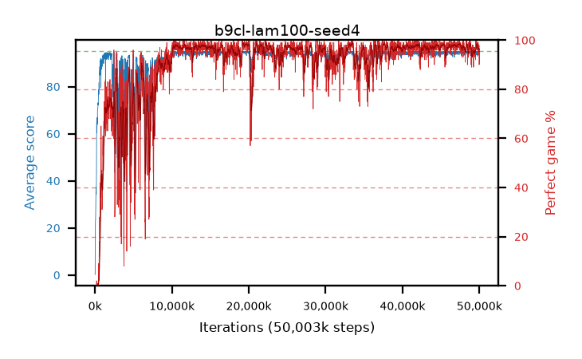

# b9cl-lam100-seed4

step **50,003,968** · 3052 evals · trailing **94.24** · peak **94.73** @19,677,184 · sef **88.2** · best30 **98.3** @33,570,816

## Config

| | |
|---|---|
| algo | ppo |
| collect_envs | 128 |
| discount | 0.99 |
| eval_interval | 16384 |
| eval_queue | True |
| eval_queue_depth | 16 |
| eval_workers | 8 |
| fc_layers | (320,) |
| graph_eval_episodes | 100 |
| max_steps | 50003968 |
| min_checkpoint_score | 40.0 |
| ppo_adam_epsilon | 1e-07 |
| ppo_clip | 0.2 |
| ppo_clip_final | None |
| ppo_entropy_coef | 0.01 |
| ppo_entropy_coef_final | None |
| ppo_epochs | 4 |
| ppo_gae_lambda | 1.0 |
| ppo_gradient_clipping | 0.5 |
| ppo_horizon | 100.0 |
| ppo_learning_rate | 0.0003 |
| ppo_learning_rate_final | None |
| ppo_minibatch | 256 |
| ppo_normalize_adv | True |
| ppo_rollout | 128 |
| ppo_target_kl | 0.0 |
| ppo_transitions_per_rollout | 16384 |
| ppo_value_loss | huber |
| ppo_vf_coef | 0.5 |
| seed | 4 |
| torch_threads | 1 |

## Evals

| step | avg score | trailing avg | min score | max score | avg reward | perfect % | epsilon |
|---|---|---|---|---|---|---|---|
| 16384 | 0.24 | 0.24 | 0.0 | 1.0 | -0.62 | 0.0 |  |
| 32768 | 14.81 | 7.53 | 3.0 | 32.0 | 9.9 | 0.0 |  |
| 49152 | 21.94 | 12.33 | 2.0 | 39.0 | 16.985 | 0.0 |  |
| ... | ... | ... | ... | ... | ... | ... | ... |
| 49823744 | 93.52 | 94.18 | 14.0 | 95.0 | 186.55 | 94.0 |  |
| 49840128 | 94.9 | 94.19 | 85.0 | 95.0 | 192.905 | 99.0 |  |
| 49856512 | 94.83 | 94.2 | 86.0 | 95.0 | 191.84 | 98.0 |  |
| 49872896 | 93.74 | 94.19 | 18.0 | 95.0 | 186.77 | 94.0 |  |
| 49889280 | 94.48 | 94.19 | 73.0 | 95.0 | 189.5 | 96.0 |  |
| 49905664 | 94.62 | 94.2 | 64.0 | 95.0 | 191.63 | 98.0 |  |
| 49922048 | 94.68 | 94.19 | 80.0 | 95.0 | 190.695 | 97.0 |  |
| 49938432 | 93.55 | 94.21 | 26.0 | 95.0 | 188.48 | 96.0 |  |
| 49954816 | 94.85 | 94.23 | 86.0 | 95.0 | 191.86 | 98.0 |  |
| 49971200 | 93.55 | 94.26 | 58.0 | 95.0 | 182.555 | 90.0 |  |
| 49987584 | 92.96 | 94.22 | 6.0 | 95.0 | 183.005 | 91.0 |  |
| 50003968 | 94.25 | 94.24 | 76.0 | 95.0 | 187.28 | 94.0 |  |
