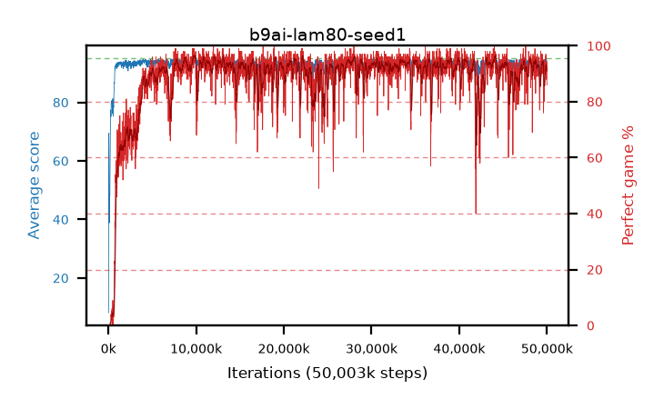

# b9ai-lam80-seed1

step **50,003,968** · 3052 evals · trailing **93.44** · peak **94.3** @7,749,632 · sef **87.1** · best30 **95.7** @9,945,088

## Config

| | |
|---|---|
| algo | ppo |
| collect_envs | 128 |
| discount | 0.99 |
| eval_interval | 16384 |
| eval_queue | True |
| eval_queue_depth | 16 |
| eval_workers | 8 |
| fc_layers | (320,) |
| graph_eval_episodes | 100 |
| max_steps | 50003968 |
| min_checkpoint_score | 40.0 |
| ppo_adam_epsilon | 1e-07 |
| ppo_clip | 0.2 |
| ppo_clip_final | None |
| ppo_entropy_coef | 0.01 |
| ppo_entropy_coef_final | None |
| ppo_epochs | 4 |
| ppo_gae_lambda | 0.8 |
| ppo_gradient_clipping | 0.5 |
| ppo_horizon | 4.8 |
| ppo_learning_rate | 0.0003 |
| ppo_learning_rate_final | None |
| ppo_minibatch | 256 |
| ppo_normalize_adv | True |
| ppo_rollout | 128 |
| ppo_target_kl | 0.0 |
| ppo_transitions_per_rollout | 16384 |
| ppo_value_loss | huber |
| ppo_vf_coef | 0.5 |
| seed | 1 |
| torch_threads | 1 |

## Evals

| step | avg score | trailing avg | min score | max score | avg reward | perfect % | epsilon |
|---|---|---|---|---|---|---|---|
| 16384 | 8.13 | 8.13 | 0.0 | 26.0 | 7.63 | 0.0 |  |
| 32768 | 57.75 | 39.97 | 1.0 | 81.0 | 54.19 | 0.0 |  |
| 49152 | 69.47 | 46.16 | 31.0 | 91.0 | 67.08 | 0.0 |  |
| ... | ... | ... | ... | ... | ... | ... | ... |
| 49823744 | 93.64 | 93.66 | 8.0 | 95.0 | 182.6 | 90.0 |  |
| 49840128 | 94.53 | 93.63 | 75.0 | 95.0 | 189.505 | 96.0 |  |
| 49856512 | 91.26 | 93.62 | 6.0 | 95.0 | 180.175 | 90.0 |  |
| 49872896 | 94.89 | 93.6 | 90.0 | 95.0 | 190.905 | 97.0 |  |
| 49889280 | 94.12 | 93.63 | 58.0 | 95.0 | 186.065 | 93.0 |  |
| 49905664 | 93.1 | 93.61 | 12.0 | 95.0 | 184.005 | 92.0 |  |
| 49922048 | 93.52 | 93.51 | 37.0 | 95.0 | 182.435 | 90.0 |  |
| 49938432 | 93.53 | 93.41 | 75.0 | 95.0 | 180.545 | 88.0 |  |
| 49954816 | 94.36 | 93.42 | 75.0 | 95.0 | 186.395 | 93.0 |  |
| 49971200 | 94.22 | 93.61 | 75.0 | 95.0 | 187.25 | 94.0 |  |
| 49987584 | 92.71 | 93.54 | 66.0 | 95.0 | 178.775 | 87.0 |  |
| 50003968 | 92.62 | 93.44 | 65.0 | 95.0 | 177.69 | 86.0 |  |
