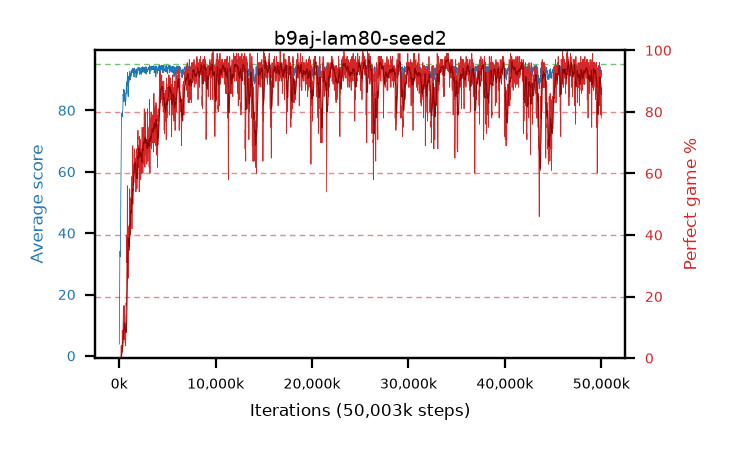

# b9aj-lam80-seed2

step **50,003,968** · 3052 evals · trailing **92.97** · peak **94.44** @34,160,640 · sef **83.7** · best30 **96.6** @34,193,408

## Config

| | |
|---|---|
| algo | ppo |
| collect_envs | 128 |
| discount | 0.99 |
| eval_interval | 16384 |
| eval_queue | True |
| eval_queue_depth | 16 |
| eval_workers | 8 |
| fc_layers | (320,) |
| graph_eval_episodes | 100 |
| max_steps | 50003968 |
| min_checkpoint_score | 40.0 |
| ppo_adam_epsilon | 1e-07 |
| ppo_clip | 0.2 |
| ppo_clip_final | None |
| ppo_entropy_coef | 0.01 |
| ppo_entropy_coef_final | None |
| ppo_epochs | 4 |
| ppo_gae_lambda | 0.8 |
| ppo_gradient_clipping | 0.5 |
| ppo_horizon | 4.8 |
| ppo_learning_rate | 0.0003 |
| ppo_learning_rate_final | None |
| ppo_minibatch | 256 |
| ppo_normalize_adv | True |
| ppo_rollout | 128 |
| ppo_target_kl | 0.0 |
| ppo_transitions_per_rollout | 16384 |
| ppo_value_loss | huber |
| ppo_vf_coef | 0.5 |
| seed | 2 |
| torch_threads | 1 |

## Evals

| step | avg score | trailing avg | min score | max score | avg reward | perfect % | epsilon |
|---|---|---|---|---|---|---|---|
| 16384 | 3.84 | 3.84 | 0.0 | 10.0 | -0.395 | 0.0 |  |
| 32768 | 13.02 | 13.49 | 0.0 | 34.0 | 9.19 | 0.0 |  |
| 49152 | 23.6 | 13.72 | 0.0 | 49.0 | 19.005 | 0.0 |  |
| ... | ... | ... | ... | ... | ... | ... | ... |
| 49823744 | 94.6 | 93.24 | 80.0 | 95.0 | 189.62 | 96.0 |  |
| 49840128 | 94.47 | 93.22 | 81.0 | 95.0 | 186.415 | 93.0 |  |
| 49856512 | 93.68 | 93.13 | 36.0 | 95.0 | 184.63 | 92.0 |  |
| 49872896 | 93.39 | 93.14 | 69.0 | 95.0 | 178.415 | 86.0 |  |
| 49889280 | 93.57 | 93.09 | 8.0 | 95.0 | 185.605 | 93.0 |  |
| 49905664 | 92.94 | 93.07 | 8.0 | 95.0 | 173.035 | 81.0 |  |
| 49922048 | 93.88 | 93.04 | 75.0 | 95.0 | 180.895 | 88.0 |  |
| 49938432 | 91.5 | 93.09 | 38.0 | 95.0 | 169.56 | 79.0 |  |
| 49954816 | 93.0 | 93.03 | 15.0 | 95.0 | 178.975 | 87.0 |  |
| 49971200 | 90.58 | 93.01 | 18.0 | 95.0 | 177.55 | 88.0 |  |
| 49987584 | 93.1 | 93.04 | 40.0 | 95.0 | 177.175 | 85.0 |  |
| 50003968 | 91.87 | 92.97 | 18.0 | 95.0 | 168.98 | 78.0 |  |
