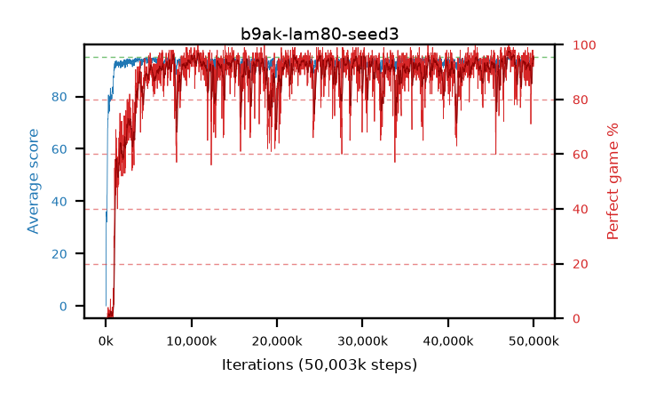

# b9ak-lam80-seed3

step **50,003,968** · 3052 evals · trailing **93.94** · peak **94.6** @47,251,456 · sef **86.0** · best30 **96.6** @47,316,992

## Config

| | |
|---|---|
| algo | ppo |
| collect_envs | 128 |
| discount | 0.99 |
| eval_interval | 16384 |
| eval_queue | True |
| eval_queue_depth | 16 |
| eval_workers | 8 |
| fc_layers | (320,) |
| graph_eval_episodes | 100 |
| max_steps | 50003968 |
| min_checkpoint_score | 40.0 |
| ppo_adam_epsilon | 1e-07 |
| ppo_clip | 0.2 |
| ppo_clip_final | None |
| ppo_entropy_coef | 0.01 |
| ppo_entropy_coef_final | None |
| ppo_epochs | 4 |
| ppo_gae_lambda | 0.8 |
| ppo_gradient_clipping | 0.5 |
| ppo_horizon | 4.8 |
| ppo_learning_rate | 0.0003 |
| ppo_learning_rate_final | None |
| ppo_minibatch | 256 |
| ppo_normalize_adv | True |
| ppo_rollout | 128 |
| ppo_target_kl | 0.0 |
| ppo_transitions_per_rollout | 16384 |
| ppo_value_loss | huber |
| ppo_vf_coef | 0.5 |
| seed | 3 |
| torch_threads | 1 |

## Evals

| step | avg score | trailing avg | min score | max score | avg reward | perfect % | epsilon |
|---|---|---|---|---|---|---|---|
| 16384 | 0.08 | 0.08 | 0.0 | 1.0 | -0.42 | 0.0 |  |
| 32768 | 0.78 | 0.43 | 0.0 | 4.0 | 0.28 | 0.0 |  |
| 49152 | 30.34 | 23.99 | 3.0 | 58.0 | 26.87 | 0.0 |  |
| ... | ... | ... | ... | ... | ... | ... | ... |
| 49823744 | 94.83 | 93.71 | 88.0 | 95.0 | 190.845 | 97.0 |  |
| 49840128 | 94.85 | 93.75 | 87.0 | 95.0 | 191.86 | 98.0 |  |
| 49856512 | 93.33 | 93.64 | 15.0 | 95.0 | 185.275 | 93.0 |  |
| 49872896 | 93.51 | 93.62 | 24.0 | 95.0 | 185.5 | 93.0 |  |
| 49889280 | 94.82 | 93.63 | 81.0 | 95.0 | 190.745 | 97.0 |  |
| 49905664 | 94.81 | 93.7 | 77.0 | 95.0 | 191.775 | 98.0 |  |
| 49922048 | 94.15 | 93.65 | 18.0 | 95.0 | 191.16 | 98.0 |  |
| 49938432 | 94.04 | 93.85 | 68.0 | 95.0 | 187.025 | 94.0 |  |
| 49954816 | 94.31 | 93.88 | 70.0 | 95.0 | 185.305 | 92.0 |  |
| 49971200 | 94.04 | 93.9 | 68.0 | 95.0 | 186.075 | 93.0 |  |
| 49987584 | 94.01 | 93.92 | 34.0 | 95.0 | 186.95 | 94.0 |  |
| 50003968 | 94.04 | 93.94 | 12.0 | 95.0 | 189.015 | 96.0 |  |
