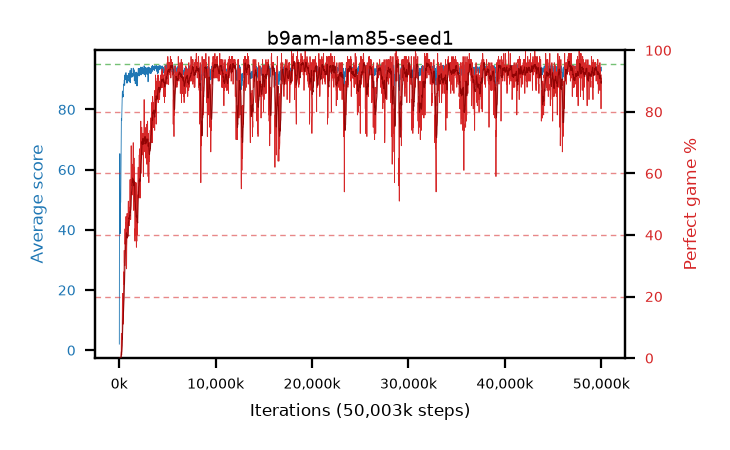

# b9am-lam85-seed1

step **50,003,968** · 3052 evals · trailing **93.43** · peak **94.32** @47,071,232 · sef **86.0** · best30 **95.2** @32,210,944

## Config

| | |
|---|---|
| algo | ppo |
| collect_envs | 128 |
| discount | 0.99 |
| eval_interval | 16384 |
| eval_queue | True |
| eval_queue_depth | 16 |
| eval_workers | 8 |
| fc_layers | (320,) |
| graph_eval_episodes | 100 |
| max_steps | 50003968 |
| min_checkpoint_score | 40.0 |
| ppo_adam_epsilon | 1e-07 |
| ppo_clip | 0.2 |
| ppo_clip_final | None |
| ppo_entropy_coef | 0.01 |
| ppo_entropy_coef_final | None |
| ppo_epochs | 4 |
| ppo_gae_lambda | 0.85 |
| ppo_gradient_clipping | 0.5 |
| ppo_horizon | 6.3 |
| ppo_learning_rate | 0.0003 |
| ppo_learning_rate_final | None |
| ppo_minibatch | 256 |
| ppo_normalize_adv | True |
| ppo_rollout | 128 |
| ppo_target_kl | 0.0 |
| ppo_transitions_per_rollout | 16384 |
| ppo_value_loss | huber |
| ppo_vf_coef | 0.5 |
| seed | 1 |
| torch_threads | 1 |

## Evals

| step | avg score | trailing avg | min score | max score | avg reward | perfect % | epsilon |
|---|---|---|---|---|---|---|---|
| 16384 | 2.04 | 2.04 | 0.0 | 8.0 | 1.54 | 0.0 |  |
| 32768 | 50.34 | 37.94 | 0.0 | 77.0 | 45.88 | 0.0 |  |
| 49152 | 61.71 | 41.85 | 5.0 | 84.0 | 59.05 | 0.0 |  |
| ... | ... | ... | ... | ... | ... | ... | ... |
| 49823744 | 93.34 | 93.44 | 61.0 | 95.0 | 182.39 | 90.0 |  |
| 49840128 | 90.66 | 93.47 | 18.0 | 95.0 | 176.68 | 87.0 |  |
| 49856512 | 93.83 | 93.4 | 14.0 | 95.0 | 188.85 | 96.0 |  |
| 49872896 | 92.67 | 93.63 | 10.0 | 95.0 | 182.715 | 91.0 |  |
| 49889280 | 92.11 | 93.39 | 16.0 | 95.0 | 182.11 | 91.0 |  |
| 49905664 | 94.06 | 93.48 | 70.0 | 95.0 | 187.09 | 94.0 |  |
| 49922048 | 93.71 | 93.38 | 65.0 | 95.0 | 181.765 | 89.0 |  |
| 49938432 | 93.98 | 93.37 | 72.0 | 95.0 | 184.025 | 91.0 |  |
| 49954816 | 93.64 | 93.41 | 73.0 | 95.0 | 179.66 | 87.0 |  |
| 49971200 | 92.72 | 93.39 | 65.0 | 95.0 | 172.815 | 81.0 |  |
| 49987584 | 93.84 | 93.4 | 81.0 | 95.0 | 178.82 | 86.0 |  |
| 50003968 | 94.04 | 93.43 | 65.0 | 95.0 | 185.08 | 92.0 |  |
