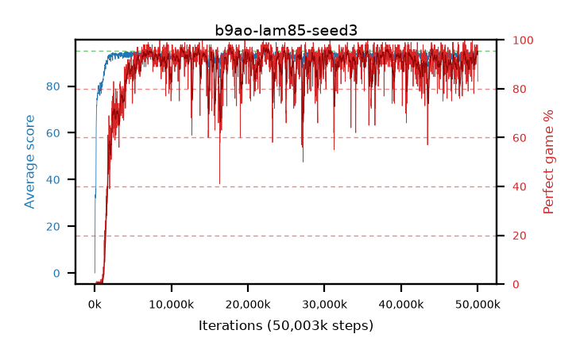

# b9ao-lam85-seed3

step **50,003,968** · 3052 evals · trailing **94.1** · peak **94.34** @22,200,320 · sef **85.6** · best30 **96.3** @22,413,312

## Config

| | |
|---|---|
| algo | ppo |
| collect_envs | 128 |
| discount | 0.99 |
| eval_interval | 16384 |
| eval_queue | True |
| eval_queue_depth | 16 |
| eval_workers | 8 |
| fc_layers | (320,) |
| graph_eval_episodes | 100 |
| max_steps | 50003968 |
| min_checkpoint_score | 40.0 |
| ppo_adam_epsilon | 1e-07 |
| ppo_clip | 0.2 |
| ppo_clip_final | None |
| ppo_entropy_coef | 0.01 |
| ppo_entropy_coef_final | None |
| ppo_epochs | 4 |
| ppo_gae_lambda | 0.85 |
| ppo_gradient_clipping | 0.5 |
| ppo_horizon | 6.3 |
| ppo_learning_rate | 0.0003 |
| ppo_learning_rate_final | None |
| ppo_minibatch | 256 |
| ppo_normalize_adv | True |
| ppo_rollout | 128 |
| ppo_target_kl | 0.0 |
| ppo_transitions_per_rollout | 16384 |
| ppo_value_loss | huber |
| ppo_vf_coef | 0.5 |
| seed | 3 |
| torch_threads | 1 |

## Evals

| step | avg score | trailing avg | min score | max score | avg reward | perfect % | epsilon |
|---|---|---|---|---|---|---|---|
| 16384 | 0.02 | 0.02 | 0.0 | 1.0 | -0.48 | 0.0 |  |
| 32768 | 2.21 | 1.11 | 0.0 | 15.0 | 1.665 | 0.0 |  |
| 49152 | 20.94 | 17.13 | 3.0 | 47.0 | 19.045 | 0.0 |  |
| ... | ... | ... | ... | ... | ... | ... | ... |
| 49823744 | 92.42 | 94.01 | 20.0 | 95.0 | 182.375 | 91.0 |  |
| 49840128 | 94.54 | 94.03 | 75.0 | 95.0 | 188.52 | 95.0 |  |
| 49856512 | 94.31 | 93.97 | 64.0 | 95.0 | 187.295 | 94.0 |  |
| 49872896 | 94.06 | 93.98 | 38.0 | 95.0 | 189.08 | 96.0 |  |
| 49889280 | 94.53 | 93.98 | 62.0 | 95.0 | 189.505 | 96.0 |  |
| 49905664 | 94.43 | 93.98 | 64.0 | 95.0 | 189.45 | 96.0 |  |
| 49922048 | 94.4 | 94.0 | 73.0 | 95.0 | 187.385 | 94.0 |  |
| 49938432 | 94.33 | 93.98 | 40.0 | 95.0 | 190.345 | 97.0 |  |
| 49954816 | 94.82 | 94.09 | 78.0 | 95.0 | 191.785 | 98.0 |  |
| 49971200 | 94.73 | 94.12 | 77.0 | 95.0 | 190.7 | 97.0 |  |
| 49987584 | 94.19 | 93.97 | 82.0 | 95.0 | 182.245 | 89.0 |  |
| 50003968 | 93.49 | 94.1 | 68.0 | 95.0 | 175.575 | 83.0 |  |
