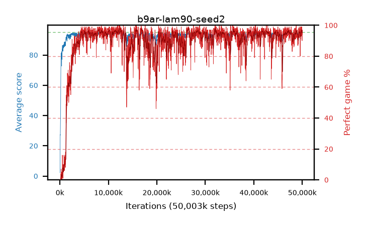

# b9ar-lam90-seed2

step **50,003,968** · 3052 evals · trailing **94.27** · peak **94.56** @12,615,680 · sef **89.0** · best30 **97.1** @26,607,616

## Config

| | |
|---|---|
| algo | ppo |
| collect_envs | 128 |
| discount | 0.99 |
| eval_interval | 16384 |
| eval_queue | True |
| eval_queue_depth | 16 |
| eval_workers | 8 |
| fc_layers | (320,) |
| graph_eval_episodes | 100 |
| max_steps | 50003968 |
| min_checkpoint_score | 40.0 |
| ppo_adam_epsilon | 1e-07 |
| ppo_clip | 0.2 |
| ppo_clip_final | None |
| ppo_entropy_coef | 0.01 |
| ppo_entropy_coef_final | None |
| ppo_epochs | 4 |
| ppo_gae_lambda | 0.9 |
| ppo_gradient_clipping | 0.5 |
| ppo_horizon | 9.2 |
| ppo_learning_rate | 0.0003 |
| ppo_learning_rate_final | None |
| ppo_minibatch | 256 |
| ppo_normalize_adv | True |
| ppo_rollout | 128 |
| ppo_target_kl | 0.0 |
| ppo_transitions_per_rollout | 16384 |
| ppo_value_loss | huber |
| ppo_vf_coef | 0.5 |
| seed | 2 |
| torch_threads | 1 |

## Evals

| step | avg score | trailing avg | min score | max score | avg reward | perfect % | epsilon |
|---|---|---|---|---|---|---|---|
| 16384 | 2.15 | 2.15 | 0.0 | 6.0 | -1.005 | 0.0 |  |
| 32768 | 6.69 | 12.06 | 0.0 | 17.0 | 3.445 | 0.0 |  |
| 49152 | 25.54 | 15.43 | 0.0 | 46.0 | 20.765 | 0.0 |  |
| ... | ... | ... | ... | ... | ... | ... | ... |
| 49823744 | 94.47 | 94.29 | 54.0 | 95.0 | 191.435 | 98.0 |  |
| 49840128 | 94.93 | 94.28 | 88.0 | 95.0 | 192.935 | 99.0 |  |
| 49856512 | 94.48 | 94.28 | 68.0 | 95.0 | 190.495 | 97.0 |  |
| 49872896 | 93.75 | 94.3 | 38.0 | 95.0 | 185.74 | 93.0 |  |
| 49889280 | 94.18 | 94.28 | 27.0 | 95.0 | 188.115 | 95.0 |  |
| 49905664 | 94.86 | 94.19 | 81.0 | 95.0 | 192.865 | 99.0 |  |
| 49922048 | 93.08 | 94.29 | 3.0 | 95.0 | 186.065 | 94.0 |  |
| 49938432 | 94.72 | 94.3 | 77.0 | 95.0 | 190.735 | 97.0 |  |
| 49954816 | 94.01 | 94.25 | 63.0 | 95.0 | 183.06 | 90.0 |  |
| 49971200 | 93.95 | 94.27 | 24.0 | 95.0 | 187.975 | 95.0 |  |
| 49987584 | 94.85 | 94.33 | 86.0 | 95.0 | 190.865 | 97.0 |  |
| 50003968 | 94.11 | 94.27 | 63.0 | 95.0 | 187.14 | 94.0 |  |
