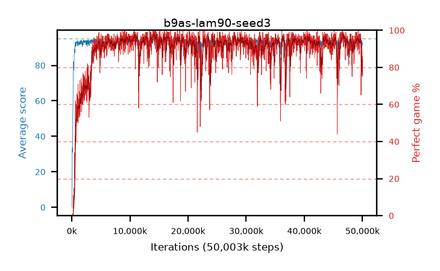

# b9as-lam90-seed3

step **50,003,968** · 3052 evals · trailing **93.39** · peak **94.48** @46,661,632 · sef **88.8** · best30 **96.8** @14,532,608

## Config

| | |
|---|---|
| algo | ppo |
| collect_envs | 128 |
| discount | 0.99 |
| eval_interval | 16384 |
| eval_queue | True |
| eval_queue_depth | 16 |
| eval_workers | 8 |
| fc_layers | (320,) |
| graph_eval_episodes | 100 |
| max_steps | 50003968 |
| min_checkpoint_score | 40.0 |
| ppo_adam_epsilon | 1e-07 |
| ppo_clip | 0.2 |
| ppo_clip_final | None |
| ppo_entropy_coef | 0.01 |
| ppo_entropy_coef_final | None |
| ppo_epochs | 4 |
| ppo_gae_lambda | 0.9 |
| ppo_gradient_clipping | 0.5 |
| ppo_horizon | 9.2 |
| ppo_learning_rate | 0.0003 |
| ppo_learning_rate_final | None |
| ppo_minibatch | 256 |
| ppo_normalize_adv | True |
| ppo_rollout | 128 |
| ppo_target_kl | 0.0 |
| ppo_transitions_per_rollout | 16384 |
| ppo_value_loss | huber |
| ppo_vf_coef | 0.5 |
| seed | 3 |
| torch_threads | 1 |

## Evals

| step | avg score | trailing avg | min score | max score | avg reward | perfect % | epsilon |
|---|---|---|---|---|---|---|---|
| 16384 | 0.06 | 0.06 | 0.0 | 1.0 | -0.755 | 0.0 |  |
| 32768 | 1.24 | 0.65 | 0.0 | 7.0 | 0.74 | 0.0 |  |
| 49152 | 23.56 | 8.29 | 3.0 | 45.0 | 19.55 | 0.0 |  |
| ... | ... | ... | ... | ... | ... | ... | ... |
| 49823744 | 91.54 | 93.52 | 71.0 | 95.0 | 169.645 | 79.0 |  |
| 49840128 | 92.55 | 93.45 | 69.0 | 95.0 | 176.625 | 85.0 |  |
| 49856512 | 93.69 | 93.77 | 76.0 | 95.0 | 181.7 | 89.0 |  |
| 49872896 | 91.73 | 93.69 | 64.0 | 95.0 | 166.85 | 76.0 |  |
| 49889280 | 92.78 | 93.4 | 68.0 | 95.0 | 171.88 | 80.0 |  |
| 49905664 | 92.25 | 93.62 | 68.0 | 95.0 | 176.325 | 85.0 |  |
| 49922048 | 93.91 | 93.4 | 68.0 | 95.0 | 184.95 | 92.0 |  |
| 49938432 | 93.69 | 93.42 | 69.0 | 95.0 | 181.745 | 89.0 |  |
| 49954816 | 92.21 | 93.25 | 65.0 | 95.0 | 173.3 | 82.0 |  |
| 49971200 | 92.09 | 93.3 | 63.0 | 95.0 | 174.175 | 83.0 |  |
| 49987584 | 91.48 | 93.18 | 65.0 | 95.0 | 165.56 | 75.0 |  |
| 50003968 | 92.38 | 93.39 | 18.0 | 95.0 | 177.45 | 86.0 |  |
