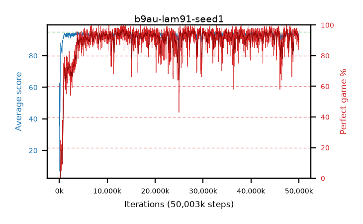

# b9au-lam91-seed1

step **50,003,968** · 3052 evals · trailing **93.6** · peak **94.34** @26,230,784 · sef **89.2** · best30 **96.5** @13,385,728

## Config

| | |
|---|---|
| algo | ppo |
| collect_envs | 128 |
| discount | 0.99 |
| eval_interval | 16384 |
| eval_queue | True |
| eval_queue_depth | 16 |
| eval_workers | 8 |
| fc_layers | (320,) |
| graph_eval_episodes | 100 |
| max_steps | 50003968 |
| min_checkpoint_score | 40.0 |
| ppo_adam_epsilon | 1e-07 |
| ppo_clip | 0.2 |
| ppo_clip_final | None |
| ppo_entropy_coef | 0.01 |
| ppo_entropy_coef_final | None |
| ppo_epochs | 4 |
| ppo_gae_lambda | 0.91 |
| ppo_gradient_clipping | 0.5 |
| ppo_horizon | 10.1 |
| ppo_learning_rate | 0.0003 |
| ppo_learning_rate_final | None |
| ppo_minibatch | 256 |
| ppo_normalize_adv | True |
| ppo_rollout | 128 |
| ppo_target_kl | 0.0 |
| ppo_transitions_per_rollout | 16384 |
| ppo_value_loss | huber |
| ppo_vf_coef | 0.5 |
| seed | 1 |
| torch_threads | 1 |

## Evals

| step | avg score | trailing avg | min score | max score | avg reward | perfect % | epsilon |
|---|---|---|---|---|---|---|---|
| 16384 | 6.8 | 6.8 | 0.0 | 23.0 | 6.12 | 0.0 |  |
| 32768 | 62.83 | 41.82 | 0.0 | 84.0 | 60.035 | 0.0 |  |
| 49152 | 55.87 | 38.58 | 4.0 | 89.0 | 52.085 | 0.0 |  |
| ... | ... | ... | ... | ... | ... | ... | ... |
| 49823744 | 93.69 | 93.75 | 63.0 | 95.0 | 182.74 | 90.0 |  |
| 49840128 | 93.68 | 93.81 | 10.0 | 95.0 | 186.665 | 94.0 |  |
| 49856512 | 93.7 | 93.72 | 63.0 | 95.0 | 183.655 | 91.0 |  |
| 49872896 | 93.23 | 93.72 | 12.0 | 95.0 | 184.225 | 92.0 |  |
| 49889280 | 93.16 | 93.66 | 12.0 | 95.0 | 184.155 | 92.0 |  |
| 49905664 | 93.32 | 93.67 | 14.0 | 95.0 | 185.265 | 93.0 |  |
| 49922048 | 94.01 | 93.67 | 66.0 | 95.0 | 185.05 | 92.0 |  |
| 49938432 | 92.41 | 93.61 | 60.0 | 95.0 | 175.445 | 84.0 |  |
| 49954816 | 93.31 | 93.6 | 75.0 | 95.0 | 177.385 | 85.0 |  |
| 49971200 | 94.16 | 93.69 | 69.0 | 95.0 | 185.155 | 92.0 |  |
| 49987584 | 94.25 | 93.59 | 63.0 | 95.0 | 188.23 | 95.0 |  |
| 50003968 | 94.25 | 93.6 | 59.0 | 95.0 | 190.265 | 97.0 |  |
