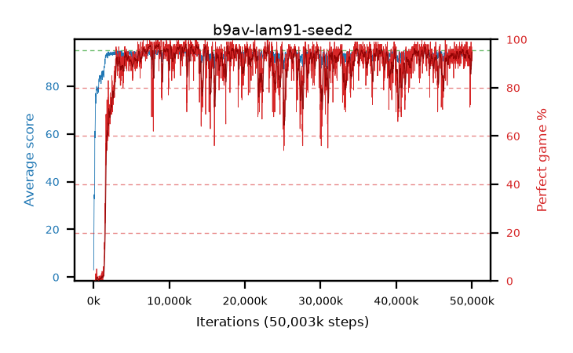

# b9av-lam91-seed2

step **50,003,968** · 3052 evals · trailing **93.66** · peak **94.41** @13,664,256 · sef **87.5** · best30 **97.4** @8,617,984

## Config

| | |
|---|---|
| algo | ppo |
| collect_envs | 128 |
| discount | 0.99 |
| eval_interval | 16384 |
| eval_queue | True |
| eval_queue_depth | 16 |
| eval_workers | 8 |
| fc_layers | (320,) |
| graph_eval_episodes | 100 |
| max_steps | 50003968 |
| min_checkpoint_score | 40.0 |
| ppo_adam_epsilon | 1e-07 |
| ppo_clip | 0.2 |
| ppo_clip_final | None |
| ppo_entropy_coef | 0.01 |
| ppo_entropy_coef_final | None |
| ppo_epochs | 4 |
| ppo_gae_lambda | 0.91 |
| ppo_gradient_clipping | 0.5 |
| ppo_horizon | 10.1 |
| ppo_learning_rate | 0.0003 |
| ppo_learning_rate_final | None |
| ppo_minibatch | 256 |
| ppo_normalize_adv | True |
| ppo_rollout | 128 |
| ppo_target_kl | 0.0 |
| ppo_transitions_per_rollout | 16384 |
| ppo_value_loss | huber |
| ppo_vf_coef | 0.5 |
| seed | 2 |
| torch_threads | 1 |

## Evals

| step | avg score | trailing avg | min score | max score | avg reward | perfect % | epsilon |
|---|---|---|---|---|---|---|---|
| 16384 | 3.02 | 3.02 | 1.0 | 9.0 | -0.765 | 0.0 |  |
| 32768 | 12.06 | 7.54 | 3.0 | 27.0 | 7.87 | 0.0 |  |
| 49152 | 24.99 | 17.04 | 0.0 | 59.0 | 20.215 | 0.0 |  |
| ... | ... | ... | ... | ... | ... | ... | ... |
| 49823744 | 94.13 | 93.65 | 72.0 | 95.0 | 186.165 | 93.0 |  |
| 49840128 | 94.57 | 93.66 | 82.0 | 95.0 | 186.605 | 93.0 |  |
| 49856512 | 93.1 | 93.62 | 16.0 | 95.0 | 186.13 | 94.0 |  |
| 49872896 | 94.97 | 93.49 | 92.0 | 95.0 | 192.975 | 99.0 |  |
| 49889280 | 92.64 | 93.47 | 12.0 | 95.0 | 180.605 | 89.0 |  |
| 49905664 | 94.75 | 93.6 | 80.0 | 95.0 | 190.72 | 97.0 |  |
| 49922048 | 94.55 | 93.68 | 70.0 | 95.0 | 190.52 | 97.0 |  |
| 49938432 | 92.97 | 93.62 | 7.0 | 95.0 | 186.995 | 95.0 |  |
| 49954816 | 94.69 | 93.61 | 82.0 | 95.0 | 190.66 | 97.0 |  |
| 49971200 | 93.37 | 93.6 | 6.0 | 95.0 | 183.415 | 91.0 |  |
| 49987584 | 93.64 | 93.5 | 36.0 | 95.0 | 185.54 | 93.0 |  |
| 50003968 | 94.25 | 93.66 | 44.0 | 95.0 | 188.23 | 95.0 |  |
