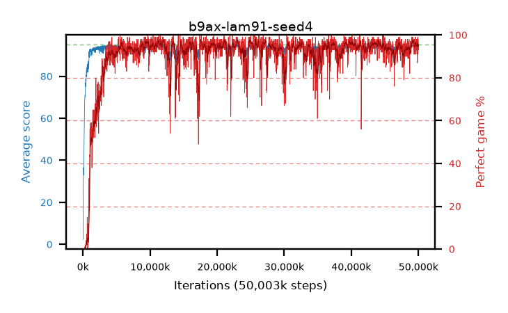

# b9ax-lam91-seed4

step **50,003,968** · 3052 evals · trailing **94.06** · peak **94.57** @39,862,272 · sef **91.1** · best30 **96.9** @25,198,592

## Config

| | |
|---|---|
| algo | ppo |
| collect_envs | 128 |
| discount | 0.99 |
| eval_interval | 16384 |
| eval_queue | True |
| eval_queue_depth | 16 |
| eval_workers | 8 |
| fc_layers | (320,) |
| graph_eval_episodes | 100 |
| max_steps | 50003968 |
| min_checkpoint_score | 40.0 |
| ppo_adam_epsilon | 1e-07 |
| ppo_clip | 0.2 |
| ppo_clip_final | None |
| ppo_entropy_coef | 0.01 |
| ppo_entropy_coef_final | None |
| ppo_epochs | 4 |
| ppo_gae_lambda | 0.91 |
| ppo_gradient_clipping | 0.5 |
| ppo_horizon | 10.1 |
| ppo_learning_rate | 0.0003 |
| ppo_learning_rate_final | None |
| ppo_minibatch | 256 |
| ppo_normalize_adv | True |
| ppo_rollout | 128 |
| ppo_target_kl | 0.0 |
| ppo_transitions_per_rollout | 16384 |
| ppo_value_loss | huber |
| ppo_vf_coef | 0.5 |
| seed | 4 |
| torch_threads | 1 |

## Evals

| step | avg score | trailing avg | min score | max score | avg reward | perfect % | epsilon |
|---|---|---|---|---|---|---|---|
| 16384 | 2.38 | 2.38 | 0.0 | 8.0 | 0.89 | 0.0 |  |
| 32768 | 4.13 | 27.66 | 0.0 | 36.0 | 3.18 | 0.0 |  |
| 49152 | 27.81 | 15.09 | 2.0 | 52.0 | 22.9 | 0.0 |  |
| ... | ... | ... | ... | ... | ... | ... | ... |
| 49823744 | 94.31 | 94.05 | 59.0 | 95.0 | 189.285 | 96.0 |  |
| 49840128 | 93.57 | 94.06 | 68.0 | 95.0 | 179.5 | 87.0 |  |
| 49856512 | 94.08 | 94.11 | 36.0 | 95.0 | 189.055 | 96.0 |  |
| 49872896 | 94.45 | 94.08 | 76.0 | 95.0 | 189.47 | 96.0 |  |
| 49889280 | 94.67 | 94.07 | 62.0 | 95.0 | 192.675 | 99.0 |  |
| 49905664 | 94.55 | 94.09 | 64.0 | 95.0 | 190.565 | 97.0 |  |
| 49922048 | 93.95 | 94.01 | 53.0 | 95.0 | 183.905 | 91.0 |  |
| 49938432 | 93.71 | 94.04 | 46.0 | 95.0 | 185.7 | 93.0 |  |
| 49954816 | 94.92 | 94.1 | 90.0 | 95.0 | 191.93 | 98.0 |  |
| 49971200 | 94.3 | 94.06 | 32.0 | 95.0 | 190.315 | 97.0 |  |
| 49987584 | 94.4 | 94.06 | 75.0 | 95.0 | 186.39 | 93.0 |  |
| 50003968 | 93.05 | 94.06 | 6.0 | 95.0 | 187.075 | 95.0 |  |
