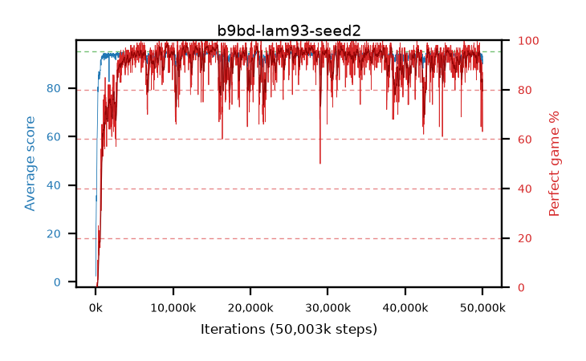

# b9bd-lam93-seed2

step **50,003,968** · 3052 evals · trailing **93.0** · peak **94.38** @12,746,752 · sef **89.7** · best30 **97.5** @9,355,264

## Config

| | |
|---|---|
| algo | ppo |
| collect_envs | 128 |
| discount | 0.99 |
| eval_interval | 16384 |
| eval_queue | True |
| eval_queue_depth | 16 |
| eval_workers | 8 |
| fc_layers | (320,) |
| graph_eval_episodes | 100 |
| max_steps | 50003968 |
| min_checkpoint_score | 40.0 |
| ppo_adam_epsilon | 1e-07 |
| ppo_clip | 0.2 |
| ppo_clip_final | None |
| ppo_entropy_coef | 0.01 |
| ppo_entropy_coef_final | None |
| ppo_epochs | 4 |
| ppo_gae_lambda | 0.93 |
| ppo_gradient_clipping | 0.5 |
| ppo_horizon | 12.6 |
| ppo_learning_rate | 0.0003 |
| ppo_learning_rate_final | None |
| ppo_minibatch | 256 |
| ppo_normalize_adv | True |
| ppo_rollout | 128 |
| ppo_target_kl | 0.0 |
| ppo_transitions_per_rollout | 16384 |
| ppo_value_loss | huber |
| ppo_vf_coef | 0.5 |
| seed | 2 |
| torch_threads | 1 |

## Evals

| step | avg score | trailing avg | min score | max score | avg reward | perfect % | epsilon |
|---|---|---|---|---|---|---|---|
| 16384 | 2.44 | 2.44 | 1.0 | 7.0 | -0.985 | 0.0 |  |
| 32768 | 5.36 | 11.18 | 0.0 | 20.0 | 2.97 | 0.0 |  |
| 49152 | 23.69 | 14.3 | 0.0 | 41.0 | 18.825 | 0.0 |  |
| ... | ... | ... | ... | ... | ... | ... | ... |
| 49823744 | 93.63 | 93.97 | 66.0 | 95.0 | 184.67 | 92.0 |  |
| 49840128 | 92.61 | 93.92 | 32.0 | 95.0 | 177.68 | 86.0 |  |
| 49856512 | 94.17 | 93.86 | 73.0 | 95.0 | 183.175 | 90.0 |  |
| 49872896 | 93.65 | 93.57 | 76.0 | 95.0 | 181.705 | 89.0 |  |
| 49889280 | 93.76 | 93.53 | 37.0 | 95.0 | 183.76 | 91.0 |  |
| 49905664 | 91.77 | 93.52 | 20.0 | 95.0 | 170.78 | 80.0 |  |
| 49922048 | 91.36 | 93.44 | 26.0 | 95.0 | 166.39 | 76.0 |  |
| 49938432 | 91.8 | 93.71 | 69.0 | 95.0 | 166.875 | 76.0 |  |
| 49954816 | 90.67 | 93.35 | 22.0 | 95.0 | 159.82 | 70.0 |  |
| 49971200 | 89.84 | 93.17 | 66.0 | 95.0 | 152.025 | 63.0 |  |
| 49987584 | 90.41 | 93.05 | 41.0 | 95.0 | 163.45 | 74.0 |  |
| 50003968 | 93.21 | 93.0 | 71.0 | 95.0 | 179.275 | 87.0 |  |
