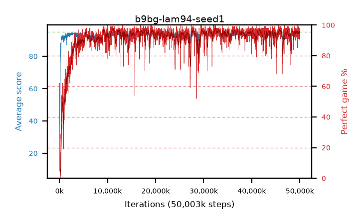

# b9bg-lam94-seed1

step **50,003,968** · 3052 evals · trailing **94.01** · peak **94.58** @32,931,840 · sef **92.7** · best30 **97.0** @11,321,344

## Config

| | |
|---|---|
| algo | ppo |
| collect_envs | 128 |
| discount | 0.99 |
| eval_interval | 16384 |
| eval_queue | True |
| eval_queue_depth | 16 |
| eval_workers | 8 |
| fc_layers | (320,) |
| graph_eval_episodes | 100 |
| max_steps | 50003968 |
| min_checkpoint_score | 40.0 |
| ppo_adam_epsilon | 1e-07 |
| ppo_clip | 0.2 |
| ppo_clip_final | None |
| ppo_entropy_coef | 0.01 |
| ppo_entropy_coef_final | None |
| ppo_epochs | 4 |
| ppo_gae_lambda | 0.94 |
| ppo_gradient_clipping | 0.5 |
| ppo_horizon | 14.4 |
| ppo_learning_rate | 0.0003 |
| ppo_learning_rate_final | None |
| ppo_minibatch | 256 |
| ppo_normalize_adv | True |
| ppo_rollout | 128 |
| ppo_target_kl | 0.0 |
| ppo_transitions_per_rollout | 16384 |
| ppo_value_loss | huber |
| ppo_vf_coef | 0.5 |
| seed | 1 |
| torch_threads | 1 |

## Evals

| step | avg score | trailing avg | min score | max score | avg reward | perfect % | epsilon |
|---|---|---|---|---|---|---|---|
| 16384 | 8.83 | 8.83 | 0.0 | 23.0 | 8.195 | 0.0 |  |
| 32768 | 63.45 | 42.62 | 35.0 | 84.0 | 59.395 | 0.0 |  |
| 49152 | 56.21 | 39.64 | 5.0 | 86.0 | 52.155 | 0.0 |  |
| ... | ... | ... | ... | ... | ... | ... | ... |
| 49823744 | 94.52 | 94.04 | 76.0 | 95.0 | 188.545 | 95.0 |  |
| 49840128 | 93.99 | 94.01 | 36.0 | 95.0 | 189.01 | 96.0 |  |
| 49856512 | 92.76 | 93.94 | 12.0 | 95.0 | 185.7 | 94.0 |  |
| 49872896 | 94.21 | 94.0 | 24.0 | 95.0 | 191.22 | 98.0 |  |
| 49889280 | 94.38 | 93.99 | 66.0 | 95.0 | 188.405 | 95.0 |  |
| 49905664 | 94.43 | 93.99 | 76.0 | 95.0 | 187.415 | 94.0 |  |
| 49922048 | 94.94 | 94.0 | 91.0 | 95.0 | 191.95 | 98.0 |  |
| 49938432 | 94.36 | 93.99 | 72.0 | 95.0 | 189.38 | 96.0 |  |
| 49954816 | 93.59 | 94.04 | 26.0 | 95.0 | 183.59 | 91.0 |  |
| 49971200 | 94.46 | 94.02 | 76.0 | 95.0 | 187.445 | 94.0 |  |
| 49987584 | 93.06 | 93.95 | 18.0 | 95.0 | 182.11 | 90.0 |  |
| 50003968 | 94.0 | 94.01 | 67.0 | 95.0 | 184.995 | 92.0 |  |
