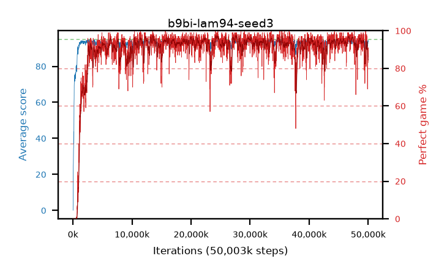

# b9bi-lam94-seed3

step **50,003,968** · 3052 evals · trailing **93.67** · peak **94.46** @24,739,840 · sef **91.8** · best30 **96.7** @24,543,232

## Config

| | |
|---|---|
| algo | ppo |
| collect_envs | 128 |
| discount | 0.99 |
| eval_interval | 16384 |
| eval_queue | True |
| eval_queue_depth | 16 |
| eval_workers | 8 |
| fc_layers | (320,) |
| graph_eval_episodes | 100 |
| max_steps | 50003968 |
| min_checkpoint_score | 40.0 |
| ppo_adam_epsilon | 1e-07 |
| ppo_clip | 0.2 |
| ppo_clip_final | None |
| ppo_entropy_coef | 0.01 |
| ppo_entropy_coef_final | None |
| ppo_epochs | 4 |
| ppo_gae_lambda | 0.94 |
| ppo_gradient_clipping | 0.5 |
| ppo_horizon | 14.4 |
| ppo_learning_rate | 0.0003 |
| ppo_learning_rate_final | None |
| ppo_minibatch | 256 |
| ppo_normalize_adv | True |
| ppo_rollout | 128 |
| ppo_target_kl | 0.0 |
| ppo_transitions_per_rollout | 16384 |
| ppo_value_loss | huber |
| ppo_vf_coef | 0.5 |
| seed | 3 |
| torch_threads | 1 |

## Evals

| step | avg score | trailing avg | min score | max score | avg reward | perfect % | epsilon |
|---|---|---|---|---|---|---|---|
| 16384 | 0.09 | 0.09 | 0.0 | 1.0 | -3.29 | 0.0 |  |
| 32768 | 5.3 | 19.57 | 0.0 | 23.0 | 3.9 | 0.0 |  |
| 49152 | 24.66 | 26.47 | 3.0 | 53.0 | 20.38 | 0.0 |  |
| ... | ... | ... | ... | ... | ... | ... | ... |
| 49823744 | 93.97 | 93.45 | 40.0 | 95.0 | 183.925 | 91.0 |  |
| 49840128 | 94.08 | 93.28 | 77.0 | 95.0 | 183.13 | 90.0 |  |
| 49856512 | 94.03 | 93.31 | 80.0 | 95.0 | 183.08 | 90.0 |  |
| 49872896 | 92.3 | 93.55 | 72.0 | 95.0 | 170.405 | 79.0 |  |
| 49889280 | 91.09 | 93.21 | 67.0 | 95.0 | 159.245 | 69.0 |  |
| 49905664 | 93.04 | 93.25 | 10.0 | 95.0 | 180.055 | 88.0 |  |
| 49922048 | 93.41 | 93.77 | 60.0 | 95.0 | 177.485 | 85.0 |  |
| 49938432 | 92.52 | 93.7 | 14.0 | 95.0 | 178.585 | 87.0 |  |
| 49954816 | 92.75 | 93.73 | 55.0 | 95.0 | 174.7 | 83.0 |  |
| 49971200 | 93.17 | 93.77 | 45.0 | 95.0 | 179.145 | 87.0 |  |
| 49987584 | 94.34 | 93.65 | 78.0 | 95.0 | 184.385 | 91.0 |  |
| 50003968 | 93.99 | 93.67 | 79.0 | 95.0 | 178.97 | 86.0 |  |
