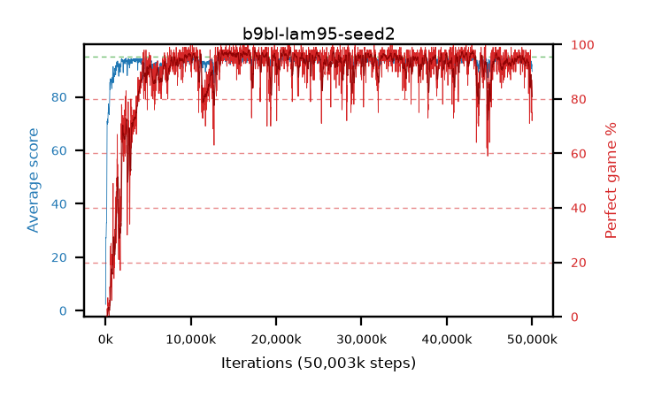

# b9bl-lam95-seed2

step **50,003,968** · 3052 evals · trailing **92.62** · peak **94.39** @14,057,472 · sef **89.6** · best30 **97.0** @14,598,144

## Config

| | |
|---|---|
| algo | ppo |
| collect_envs | 128 |
| discount | 0.99 |
| eval_interval | 16384 |
| eval_queue | True |
| eval_queue_depth | 16 |
| eval_workers | 8 |
| fc_layers | (320,) |
| graph_eval_episodes | 100 |
| max_steps | 50003968 |
| min_checkpoint_score | 40.0 |
| ppo_adam_epsilon | 1e-07 |
| ppo_clip | 0.2 |
| ppo_clip_final | None |
| ppo_entropy_coef | 0.01 |
| ppo_entropy_coef_final | None |
| ppo_epochs | 4 |
| ppo_gae_lambda | 0.95 |
| ppo_gradient_clipping | 0.5 |
| ppo_horizon | 16.8 |
| ppo_learning_rate | 0.0003 |
| ppo_learning_rate_final | None |
| ppo_minibatch | 256 |
| ppo_normalize_adv | True |
| ppo_rollout | 128 |
| ppo_target_kl | 0.0 |
| ppo_transitions_per_rollout | 16384 |
| ppo_value_loss | huber |
| ppo_vf_coef | 0.5 |
| seed | 2 |
| torch_threads | 1 |

## Evals

| step | avg score | trailing avg | min score | max score | avg reward | perfect % | epsilon |
|---|---|---|---|---|---|---|---|
| 16384 | 2.35 | 2.35 | 0.0 | 8.0 | -1.12 | 0.0 |  |
| 32768 | 20.68 | 25.23 | 4.0 | 56.0 | 16.31 | 0.0 |  |
| 49152 | 27.42 | 19.2 | 6.0 | 55.0 | 22.42 | 0.0 |  |
| ... | ... | ... | ... | ... | ... | ... | ... |
| 49823744 | 92.83 | 93.21 | 64.0 | 95.0 | 175.865 | 84.0 |  |
| 49840128 | 93.48 | 93.19 | 77.0 | 95.0 | 179.545 | 87.0 |  |
| 49856512 | 91.86 | 93.0 | 24.0 | 95.0 | 175.89 | 85.0 |  |
| 49872896 | 92.24 | 93.12 | 64.0 | 95.0 | 174.325 | 83.0 |  |
| 49889280 | 90.57 | 93.03 | 14.0 | 95.0 | 164.695 | 75.0 |  |
| 49905664 | 91.38 | 92.89 | 11.0 | 95.0 | 171.43 | 81.0 |  |
| 49922048 | 93.41 | 92.96 | 67.0 | 95.0 | 179.475 | 87.0 |  |
| 49938432 | 91.34 | 92.53 | 18.0 | 95.0 | 171.345 | 81.0 |  |
| 49954816 | 92.3 | 92.9 | 18.0 | 95.0 | 178.365 | 87.0 |  |
| 49971200 | 91.98 | 92.84 | 65.0 | 95.0 | 173.07 | 82.0 |  |
| 49987584 | 89.97 | 92.73 | 38.0 | 95.0 | 161.11 | 72.0 |  |
| 50003968 | 89.53 | 92.62 | 16.0 | 95.0 | 163.655 | 75.0 |  |
