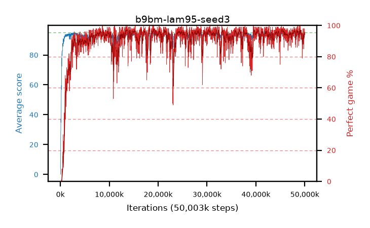

# b9bm-lam95-seed3

step **50,003,968** · 3052 evals · trailing **93.94** · peak **94.49** @48,283,648 · sef **92.1** · best30 **96.9** @13,697,024

## Config

| | |
|---|---|
| algo | ppo |
| collect_envs | 128 |
| discount | 0.99 |
| eval_interval | 16384 |
| eval_queue | True |
| eval_queue_depth | 16 |
| eval_workers | 8 |
| fc_layers | (320,) |
| graph_eval_episodes | 100 |
| max_steps | 50003968 |
| min_checkpoint_score | 40.0 |
| ppo_adam_epsilon | 1e-07 |
| ppo_clip | 0.2 |
| ppo_clip_final | None |
| ppo_entropy_coef | 0.01 |
| ppo_entropy_coef_final | None |
| ppo_epochs | 4 |
| ppo_gae_lambda | 0.95 |
| ppo_gradient_clipping | 0.5 |
| ppo_horizon | 16.8 |
| ppo_learning_rate | 0.0003 |
| ppo_learning_rate_final | None |
| ppo_minibatch | 256 |
| ppo_normalize_adv | True |
| ppo_rollout | 128 |
| ppo_target_kl | 0.0 |
| ppo_transitions_per_rollout | 16384 |
| ppo_value_loss | huber |
| ppo_vf_coef | 0.5 |
| seed | 3 |
| torch_threads | 1 |

## Evals

| step | avg score | trailing avg | min score | max score | avg reward | perfect % | epsilon |
|---|---|---|---|---|---|---|---|
| 16384 | 0.05 | 0.05 | 0.0 | 1.0 | -0.45 | 0.0 |  |
| 32768 | 0.55 | 0.3 | 0.0 | 7.0 | 0.05 | 0.0 |  |
| 49152 | 10.59 | 13.87 | 3.0 | 28.0 | 7.885 | 0.0 |  |
| ... | ... | ... | ... | ... | ... | ... | ... |
| 49823744 | 92.67 | 93.62 | 20.0 | 95.0 | 176.745 | 85.0 |  |
| 49840128 | 94.5 | 93.91 | 84.0 | 95.0 | 186.535 | 93.0 |  |
| 49856512 | 93.99 | 93.71 | 32.0 | 95.0 | 188.015 | 95.0 |  |
| 49872896 | 94.74 | 93.69 | 86.0 | 95.0 | 189.76 | 96.0 |  |
| 49889280 | 94.86 | 93.72 | 85.0 | 95.0 | 191.87 | 98.0 |  |
| 49905664 | 94.63 | 93.76 | 79.0 | 95.0 | 189.65 | 96.0 |  |
| 49922048 | 94.55 | 93.63 | 70.0 | 95.0 | 189.57 | 96.0 |  |
| 49938432 | 94.43 | 93.79 | 66.0 | 95.0 | 187.46 | 94.0 |  |
| 49954816 | 94.78 | 93.73 | 89.0 | 95.0 | 189.8 | 96.0 |  |
| 49971200 | 93.46 | 93.93 | 32.0 | 95.0 | 187.485 | 95.0 |  |
| 49987584 | 93.67 | 93.82 | 24.0 | 95.0 | 187.65 | 95.0 |  |
| 50003968 | 94.71 | 93.94 | 82.0 | 95.0 | 188.6 | 95.0 |  |
