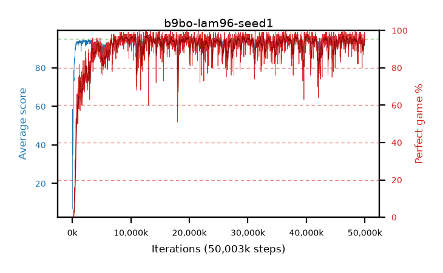

# b9bo-lam96-seed1

step **50,003,968** · 3052 evals · trailing **93.63** · peak **94.49** @40,157,184 · sef **91.8** · best30 **96.8** @12,910,592

## Config

| | |
|---|---|
| algo | ppo |
| collect_envs | 128 |
| discount | 0.99 |
| eval_interval | 16384 |
| eval_queue | True |
| eval_queue_depth | 16 |
| eval_workers | 8 |
| fc_layers | (320,) |
| graph_eval_episodes | 100 |
| max_steps | 50003968 |
| min_checkpoint_score | 40.0 |
| ppo_adam_epsilon | 1e-07 |
| ppo_clip | 0.2 |
| ppo_clip_final | None |
| ppo_entropy_coef | 0.01 |
| ppo_entropy_coef_final | None |
| ppo_epochs | 4 |
| ppo_gae_lambda | 0.96 |
| ppo_gradient_clipping | 0.5 |
| ppo_horizon | 20.2 |
| ppo_learning_rate | 0.0003 |
| ppo_learning_rate_final | None |
| ppo_minibatch | 256 |
| ppo_normalize_adv | True |
| ppo_rollout | 128 |
| ppo_target_kl | 0.0 |
| ppo_transitions_per_rollout | 16384 |
| ppo_value_loss | huber |
| ppo_vf_coef | 0.5 |
| seed | 1 |
| torch_threads | 1 |

## Evals

| step | avg score | trailing avg | min score | max score | avg reward | perfect % | epsilon |
|---|---|---|---|---|---|---|---|
| 16384 | 6.88 | 6.88 | 0.0 | 22.0 | 6.245 | 0.0 |  |
| 32768 | 58.53 | 39.75 | 13.0 | 84.0 | 54.925 | 0.0 |  |
| 49152 | 44.97 | 31.37 | 11.0 | 74.0 | 40.105 | 0.0 |  |
| ... | ... | ... | ... | ... | ... | ... | ... |
| 49823744 | 93.25 | 93.55 | 20.0 | 95.0 | 185.285 | 93.0 |  |
| 49840128 | 94.12 | 93.65 | 62.0 | 95.0 | 188.145 | 95.0 |  |
| 49856512 | 93.51 | 93.64 | 38.0 | 95.0 | 185.5 | 93.0 |  |
| 49872896 | 94.11 | 93.61 | 69.0 | 95.0 | 187.14 | 94.0 |  |
| 49889280 | 94.18 | 93.62 | 36.0 | 95.0 | 189.2 | 96.0 |  |
| 49905664 | 93.9 | 93.52 | 67.0 | 95.0 | 184.94 | 92.0 |  |
| 49922048 | 94.94 | 93.62 | 89.0 | 95.0 | 192.945 | 99.0 |  |
| 49938432 | 93.9 | 93.62 | 24.0 | 95.0 | 186.885 | 94.0 |  |
| 49954816 | 93.9 | 93.61 | 30.0 | 95.0 | 188.92 | 96.0 |  |
| 49971200 | 94.1 | 93.57 | 36.0 | 95.0 | 188.125 | 95.0 |  |
| 49987584 | 94.02 | 93.55 | 13.0 | 95.0 | 188.995 | 96.0 |  |
| 50003968 | 94.81 | 93.63 | 79.0 | 95.0 | 191.775 | 98.0 |  |
