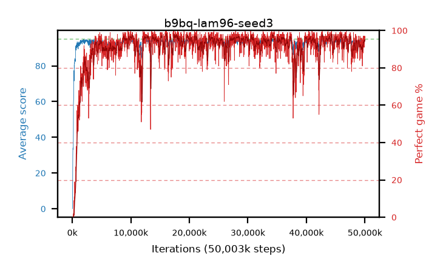

# b9bq-lam96-seed3

step **50,003,968** · 3052 evals · trailing **93.65** · peak **94.46** @17,711,104 · sef **92.0** · best30 **97.2** @17,678,336

## Config

| | |
|---|---|
| algo | ppo |
| collect_envs | 128 |
| discount | 0.99 |
| eval_interval | 16384 |
| eval_queue | True |
| eval_queue_depth | 16 |
| eval_workers | 8 |
| fc_layers | (320,) |
| graph_eval_episodes | 100 |
| max_steps | 50003968 |
| min_checkpoint_score | 40.0 |
| ppo_adam_epsilon | 1e-07 |
| ppo_clip | 0.2 |
| ppo_clip_final | None |
| ppo_entropy_coef | 0.01 |
| ppo_entropy_coef_final | None |
| ppo_epochs | 4 |
| ppo_gae_lambda | 0.96 |
| ppo_gradient_clipping | 0.5 |
| ppo_horizon | 20.2 |
| ppo_learning_rate | 0.0003 |
| ppo_learning_rate_final | None |
| ppo_minibatch | 256 |
| ppo_normalize_adv | True |
| ppo_rollout | 128 |
| ppo_target_kl | 0.0 |
| ppo_transitions_per_rollout | 16384 |
| ppo_value_loss | huber |
| ppo_vf_coef | 0.5 |
| seed | 3 |
| torch_threads | 1 |

## Evals

| step | avg score | trailing avg | min score | max score | avg reward | perfect % | epsilon |
|---|---|---|---|---|---|---|---|
| 16384 | 0.02 | 0.02 | 0.0 | 1.0 | -1.38 | 0.0 |  |
| 32768 | 1.39 | 0.7 | 0.0 | 4.0 | 0.89 | 0.0 |  |
| 49152 | 12.82 | 9.71 | 0.0 | 35.0 | 9.575 | 0.0 |  |
| ... | ... | ... | ... | ... | ... | ... | ... |
| 49823744 | 93.27 | 93.73 | 16.0 | 95.0 | 183.315 | 91.0 |  |
| 49840128 | 93.6 | 93.73 | 12.0 | 95.0 | 188.62 | 96.0 |  |
| 49856512 | 93.6 | 93.79 | 24.0 | 95.0 | 184.64 | 92.0 |  |
| 49872896 | 92.28 | 93.75 | 12.0 | 95.0 | 182.325 | 91.0 |  |
| 49889280 | 94.62 | 93.6 | 77.0 | 95.0 | 190.635 | 97.0 |  |
| 49905664 | 92.86 | 93.58 | 10.0 | 95.0 | 186.885 | 95.0 |  |
| 49922048 | 93.42 | 93.56 | 16.0 | 95.0 | 189.435 | 97.0 |  |
| 49938432 | 94.3 | 93.6 | 57.0 | 95.0 | 189.32 | 96.0 |  |
| 49954816 | 94.03 | 93.71 | 61.0 | 95.0 | 187.06 | 94.0 |  |
| 49971200 | 93.75 | 93.72 | 12.0 | 95.0 | 188.725 | 96.0 |  |
| 49987584 | 94.32 | 93.71 | 67.0 | 95.0 | 190.29 | 97.0 |  |
| 50003968 | 94.39 | 93.65 | 65.0 | 95.0 | 189.365 | 96.0 |  |
