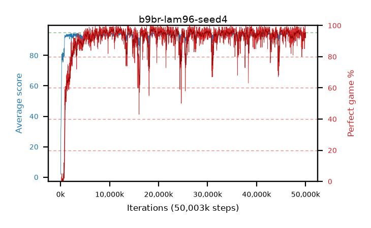

# b9br-lam96-seed4

step **50,003,968** · 3052 evals · trailing **94.11** · peak **94.52** @19,005,440 · sef **92.3** · best30 **97.4** @19,005,440

## Config

| | |
|---|---|
| algo | ppo |
| collect_envs | 128 |
| discount | 0.99 |
| eval_interval | 16384 |
| eval_queue | True |
| eval_queue_depth | 16 |
| eval_workers | 8 |
| fc_layers | (320,) |
| graph_eval_episodes | 100 |
| max_steps | 50003968 |
| min_checkpoint_score | 40.0 |
| ppo_adam_epsilon | 1e-07 |
| ppo_clip | 0.2 |
| ppo_clip_final | None |
| ppo_entropy_coef | 0.01 |
| ppo_entropy_coef_final | None |
| ppo_epochs | 4 |
| ppo_gae_lambda | 0.96 |
| ppo_gradient_clipping | 0.5 |
| ppo_horizon | 20.2 |
| ppo_learning_rate | 0.0003 |
| ppo_learning_rate_final | None |
| ppo_minibatch | 256 |
| ppo_normalize_adv | True |
| ppo_rollout | 128 |
| ppo_target_kl | 0.0 |
| ppo_transitions_per_rollout | 16384 |
| ppo_value_loss | huber |
| ppo_vf_coef | 0.5 |
| seed | 4 |
| torch_threads | 1 |

## Evals

| step | avg score | trailing avg | min score | max score | avg reward | perfect % | epsilon |
|---|---|---|---|---|---|---|---|
| 16384 | 1.87 | 1.87 | 0.0 | 6.0 | -0.34 | 0.0 |  |
| 32768 | 14.52 | 21.64 | 0.0 | 46.0 | 10.87 | 0.0 |  |
| 49152 | 27.03 | 20.22 | 11.0 | 49.0 | 22.03 | 0.0 |  |
| ... | ... | ... | ... | ... | ... | ... | ... |
| 49823744 | 92.99 | 93.86 | 67.0 | 95.0 | 180.05 | 88.0 |  |
| 49840128 | 94.64 | 93.86 | 82.0 | 95.0 | 189.66 | 96.0 |  |
| 49856512 | 94.28 | 93.9 | 81.0 | 95.0 | 185.32 | 92.0 |  |
| 49872896 | 94.81 | 93.92 | 87.0 | 95.0 | 190.825 | 97.0 |  |
| 49889280 | 95.0 | 94.06 | 95.0 | 95.0 | 194.0 | 100.0 |  |
| 49905664 | 94.62 | 93.81 | 64.0 | 95.0 | 190.635 | 97.0 |  |
| 49922048 | 94.72 | 93.85 | 83.0 | 95.0 | 190.735 | 97.0 |  |
| 49938432 | 94.3 | 94.1 | 83.0 | 95.0 | 185.34 | 92.0 |  |
| 49954816 | 94.04 | 94.11 | 22.0 | 95.0 | 189.06 | 96.0 |  |
| 49971200 | 94.55 | 94.13 | 84.0 | 95.0 | 186.585 | 93.0 |  |
| 49987584 | 94.34 | 94.12 | 77.0 | 95.0 | 187.37 | 94.0 |  |
| 50003968 | 93.49 | 94.11 | 16.0 | 95.0 | 184.485 | 92.0 |  |
