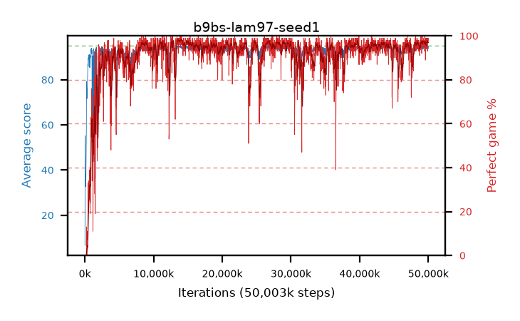

# b9bs-lam97-seed1

step **50,003,968** · 3052 evals · trailing **94.43** · peak **94.71** @13,975,552 · sef **92.4** · best30 **98.1** @14,090,240

## Config

| | |
|---|---|
| algo | ppo |
| collect_envs | 128 |
| discount | 0.99 |
| eval_interval | 16384 |
| eval_queue | True |
| eval_queue_depth | 16 |
| eval_workers | 8 |
| fc_layers | (320,) |
| graph_eval_episodes | 100 |
| max_steps | 50003968 |
| min_checkpoint_score | 40.0 |
| ppo_adam_epsilon | 1e-07 |
| ppo_clip | 0.2 |
| ppo_clip_final | None |
| ppo_entropy_coef | 0.01 |
| ppo_entropy_coef_final | None |
| ppo_epochs | 4 |
| ppo_gae_lambda | 0.97 |
| ppo_gradient_clipping | 0.5 |
| ppo_horizon | 25.2 |
| ppo_learning_rate | 0.0003 |
| ppo_learning_rate_final | None |
| ppo_minibatch | 256 |
| ppo_normalize_adv | True |
| ppo_rollout | 128 |
| ppo_target_kl | 0.0 |
| ppo_transitions_per_rollout | 16384 |
| ppo_value_loss | huber |
| ppo_vf_coef | 0.5 |
| seed | 1 |
| torch_threads | 1 |

## Evals

| step | avg score | trailing avg | min score | max score | avg reward | perfect % | epsilon |
|---|---|---|---|---|---|---|---|
| 16384 | 6.61 | 6.61 | 0.0 | 21.0 | 5.975 | 0.0 |  |
| 32768 | 55.25 | 35.66 | 25.0 | 86.0 | 50.655 | 0.0 |  |
| 49152 | 41.52 | 28.52 | 13.0 | 77.0 | 36.7 | 0.0 |  |
| ... | ... | ... | ... | ... | ... | ... | ... |
| 49823744 | 94.05 | 94.4 | 28.0 | 95.0 | 190.065 | 97.0 |  |
| 49840128 | 94.93 | 94.42 | 88.0 | 95.0 | 192.935 | 99.0 |  |
| 49856512 | 94.71 | 94.43 | 71.0 | 95.0 | 191.72 | 98.0 |  |
| 49872896 | 93.68 | 94.41 | 12.0 | 95.0 | 187.705 | 95.0 |  |
| 49889280 | 94.18 | 94.43 | 61.0 | 95.0 | 186.215 | 93.0 |  |
| 49905664 | 94.77 | 94.45 | 87.0 | 95.0 | 189.79 | 96.0 |  |
| 49922048 | 94.67 | 94.42 | 69.0 | 95.0 | 191.68 | 98.0 |  |
| 49938432 | 94.87 | 94.43 | 82.0 | 95.0 | 192.875 | 99.0 |  |
| 49954816 | 93.85 | 94.41 | 10.0 | 95.0 | 189.865 | 97.0 |  |
| 49971200 | 93.71 | 94.38 | 16.0 | 95.0 | 189.725 | 97.0 |  |
| 49987584 | 94.69 | 94.45 | 69.0 | 95.0 | 191.655 | 98.0 |  |
| 50003968 | 94.97 | 94.43 | 92.0 | 95.0 | 192.93 | 99.0 |  |
