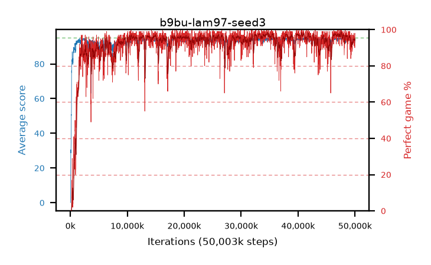

# b9bu-lam97-seed3

step **50,003,968** · 3052 evals · trailing **93.83** · peak **94.6** @47,529,984 · sef **94.0** · best30 **97.6** @34,619,392

## Config

| | |
|---|---|
| algo | ppo |
| collect_envs | 128 |
| discount | 0.99 |
| eval_interval | 16384 |
| eval_queue | True |
| eval_queue_depth | 16 |
| eval_workers | 8 |
| fc_layers | (320,) |
| graph_eval_episodes | 100 |
| max_steps | 50003968 |
| min_checkpoint_score | 40.0 |
| ppo_adam_epsilon | 1e-07 |
| ppo_clip | 0.2 |
| ppo_clip_final | None |
| ppo_entropy_coef | 0.01 |
| ppo_entropy_coef_final | None |
| ppo_epochs | 4 |
| ppo_gae_lambda | 0.97 |
| ppo_gradient_clipping | 0.5 |
| ppo_horizon | 25.2 |
| ppo_learning_rate | 0.0003 |
| ppo_learning_rate_final | None |
| ppo_minibatch | 256 |
| ppo_normalize_adv | True |
| ppo_rollout | 128 |
| ppo_target_kl | 0.0 |
| ppo_transitions_per_rollout | 16384 |
| ppo_value_loss | huber |
| ppo_vf_coef | 0.5 |
| seed | 3 |
| torch_threads | 1 |

## Evals

| step | avg score | trailing avg | min score | max score | avg reward | perfect % | epsilon |
|---|---|---|---|---|---|---|---|
| 16384 | 0.05 | 0.05 | 0.0 | 2.0 | -2.295 | 0.0 |  |
| 32768 | 2.65 | 1.35 | 0.0 | 11.0 | 1.97 | 0.0 |  |
| 49152 | 18.81 | 11.47 | 0.0 | 37.0 | 14.26 | 0.0 |  |
| ... | ... | ... | ... | ... | ... | ... | ... |
| 49823744 | 93.71 | 93.65 | 30.0 | 95.0 | 183.755 | 91.0 |  |
| 49840128 | 94.22 | 93.68 | 37.0 | 95.0 | 191.185 | 98.0 |  |
| 49856512 | 94.65 | 93.7 | 69.0 | 95.0 | 189.67 | 96.0 |  |
| 49872896 | 93.91 | 93.76 | 7.0 | 95.0 | 187.89 | 95.0 |  |
| 49889280 | 93.33 | 93.69 | 18.0 | 95.0 | 188.35 | 96.0 |  |
| 49905664 | 94.38 | 93.76 | 69.0 | 95.0 | 188.405 | 95.0 |  |
| 49922048 | 94.26 | 93.71 | 81.0 | 95.0 | 185.3 | 92.0 |  |
| 49938432 | 94.27 | 93.76 | 79.0 | 95.0 | 187.3 | 94.0 |  |
| 49954816 | 92.31 | 93.77 | 18.0 | 95.0 | 181.315 | 90.0 |  |
| 49971200 | 93.48 | 93.82 | 16.0 | 95.0 | 185.515 | 93.0 |  |
| 49987584 | 94.58 | 93.82 | 58.0 | 95.0 | 191.59 | 98.0 |  |
| 50003968 | 94.51 | 93.83 | 69.0 | 95.0 | 191.52 | 98.0 |  |
