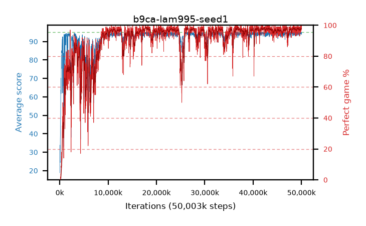

# b9ca-lam995-seed1

step **50,003,968** · 3052 evals · trailing **94.38** · peak **94.53** @26,492,928 · sef **86.8** · best30 **98.2** @18,104,320

## Config

| | |
|---|---|
| algo | ppo |
| collect_envs | 128 |
| discount | 0.99 |
| eval_interval | 16384 |
| eval_queue | True |
| eval_queue_depth | 16 |
| eval_workers | 8 |
| fc_layers | (320,) |
| graph_eval_episodes | 100 |
| max_steps | 50003968 |
| min_checkpoint_score | 40.0 |
| ppo_adam_epsilon | 1e-07 |
| ppo_clip | 0.2 |
| ppo_clip_final | None |
| ppo_entropy_coef | 0.01 |
| ppo_entropy_coef_final | None |
| ppo_epochs | 4 |
| ppo_gae_lambda | 0.995 |
| ppo_gradient_clipping | 0.5 |
| ppo_horizon | 66.9 |
| ppo_learning_rate | 0.0003 |
| ppo_learning_rate_final | None |
| ppo_minibatch | 256 |
| ppo_normalize_adv | True |
| ppo_rollout | 128 |
| ppo_target_kl | 0.0 |
| ppo_transitions_per_rollout | 16384 |
| ppo_value_loss | huber |
| ppo_vf_coef | 0.5 |
| seed | 1 |
| torch_threads | 1 |

## Evals

| step | avg score | trailing avg | min score | max score | avg reward | perfect % | epsilon |
|---|---|---|---|---|---|---|---|
| 16384 | 18.81 | 18.81 | 5.0 | 31.0 | 13.81 | 0.0 |  |
| 32768 | 33.83 | 25.93 | 9.0 | 60.0 | 28.83 | 0.0 |  |
| 49152 | 25.15 | 21.98 | 5.0 | 50.0 | 20.15 | 0.0 |  |
| ... | ... | ... | ... | ... | ... | ... | ... |
| 49823744 | 95.0 | 94.34 | 95.0 | 95.0 | 194.0 | 100.0 |  |
| 49840128 | 94.14 | 94.4 | 18.0 | 95.0 | 189.16 | 96.0 |  |
| 49856512 | 94.1 | 94.42 | 12.0 | 95.0 | 190.115 | 97.0 |  |
| 49872896 | 94.74 | 94.44 | 81.0 | 95.0 | 190.755 | 97.0 |  |
| 49889280 | 94.77 | 94.41 | 83.0 | 95.0 | 191.78 | 98.0 |  |
| 49905664 | 95.0 | 94.38 | 95.0 | 95.0 | 194.0 | 100.0 |  |
| 49922048 | 94.21 | 94.39 | 39.0 | 95.0 | 189.185 | 96.0 |  |
| 49938432 | 94.7 | 94.39 | 68.0 | 95.0 | 191.71 | 98.0 |  |
| 49954816 | 94.73 | 94.42 | 68.0 | 95.0 | 192.735 | 99.0 |  |
| 49971200 | 94.34 | 94.42 | 34.0 | 95.0 | 191.26 | 98.0 |  |
| 49987584 | 95.0 | 94.41 | 95.0 | 95.0 | 194.0 | 100.0 |  |
| 50003968 | 93.77 | 94.38 | 28.0 | 95.0 | 189.74 | 97.0 |  |
