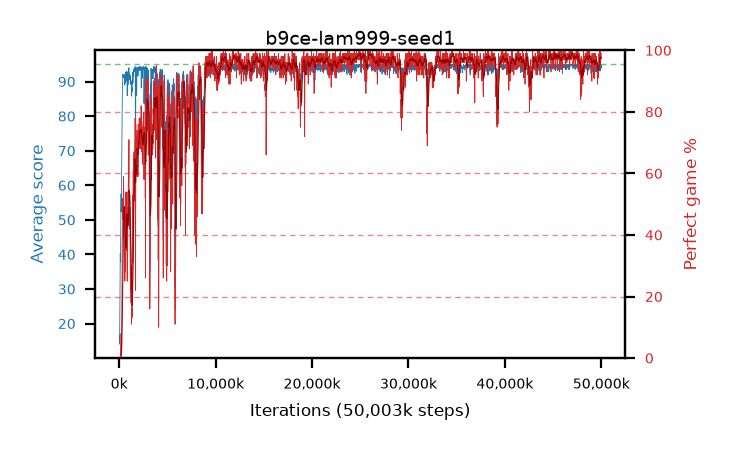

# b9ce-lam999-seed1

step **50,003,968** · 3052 evals · trailing **94.17** · peak **94.66** @46,989,312 · sef **87.5** · best30 **98.5** @26,198,016

## Config

| | |
|---|---|
| algo | ppo |
| collect_envs | 128 |
| discount | 0.99 |
| eval_interval | 16384 |
| eval_queue | True |
| eval_queue_depth | 16 |
| eval_workers | 8 |
| fc_layers | (320,) |
| graph_eval_episodes | 100 |
| max_steps | 50003968 |
| min_checkpoint_score | 40.0 |
| ppo_adam_epsilon | 1e-07 |
| ppo_clip | 0.2 |
| ppo_clip_final | None |
| ppo_entropy_coef | 0.01 |
| ppo_entropy_coef_final | None |
| ppo_epochs | 4 |
| ppo_gae_lambda | 0.999 |
| ppo_gradient_clipping | 0.5 |
| ppo_horizon | 91.0 |
| ppo_learning_rate | 0.0003 |
| ppo_learning_rate_final | None |
| ppo_minibatch | 256 |
| ppo_normalize_adv | True |
| ppo_rollout | 128 |
| ppo_target_kl | 0.0 |
| ppo_transitions_per_rollout | 16384 |
| ppo_value_loss | huber |
| ppo_vf_coef | 0.5 |
| seed | 1 |
| torch_threads | 1 |

## Evals

| step | avg score | trailing avg | min score | max score | avg reward | perfect % | epsilon |
|---|---|---|---|---|---|---|---|
| 16384 | 16.52 | 16.52 | 5.0 | 29.0 | 11.52 | 0.0 |  |
| 32768 | 14.06 | 15.29 | 5.0 | 32.0 | 9.06 | 0.0 |  |
| 49152 | 16.9 | 15.83 | 1.0 | 33.0 | 11.99 | 0.0 |  |
| ... | ... | ... | ... | ... | ... | ... | ... |
| 49823744 | 94.61 | 94.19 | 66.0 | 95.0 | 191.62 | 98.0 |  |
| 49840128 | 95.0 | 94.21 | 95.0 | 95.0 | 194.0 | 100.0 |  |
| 49856512 | 93.87 | 94.24 | 24.0 | 95.0 | 189.885 | 97.0 |  |
| 49872896 | 95.0 | 94.26 | 95.0 | 95.0 | 194.0 | 100.0 |  |
| 49889280 | 94.58 | 94.3 | 78.0 | 95.0 | 189.6 | 96.0 |  |
| 49905664 | 93.08 | 94.24 | 16.0 | 95.0 | 187.06 | 95.0 |  |
| 49922048 | 94.31 | 94.12 | 33.0 | 95.0 | 191.275 | 98.0 |  |
| 49938432 | 93.99 | 94.13 | 32.0 | 95.0 | 190.955 | 98.0 |  |
| 49954816 | 94.52 | 94.15 | 64.0 | 95.0 | 190.535 | 97.0 |  |
| 49971200 | 94.28 | 94.18 | 32.0 | 95.0 | 191.245 | 98.0 |  |
| 49987584 | 93.84 | 94.13 | 8.0 | 95.0 | 190.85 | 98.0 |  |
| 50003968 | 94.9 | 94.17 | 85.0 | 95.0 | 192.905 | 99.0 |  |
