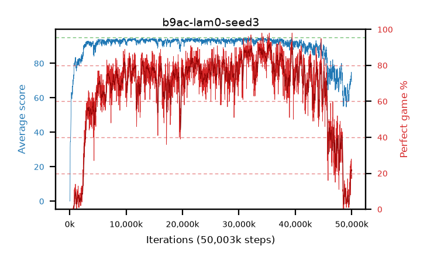

# b9ac-lam0-seed3

step **50,003,968** · 3052 evals · trailing **68.01** · peak **94.21** @35,586,048 · sef **28.1** · best30 **90.8** @35,536,896

## Config

| | |
|---|---|
| algo | ppo |
| collect_envs | 128 |
| discount | 0.99 |
| eval_interval | 16384 |
| eval_queue | True |
| eval_queue_depth | 16 |
| eval_workers | 8 |
| fc_layers | (320,) |
| graph_eval_episodes | 100 |
| max_steps | 50003968 |
| min_checkpoint_score | 40.0 |
| ppo_adam_epsilon | 1e-07 |
| ppo_clip | 0.2 |
| ppo_clip_final | None |
| ppo_entropy_coef | 0.01 |
| ppo_entropy_coef_final | None |
| ppo_epochs | 4 |
| ppo_gae_lambda | 0.0 |
| ppo_gradient_clipping | 0.5 |
| ppo_horizon | 1.0 |
| ppo_learning_rate | 0.0003 |
| ppo_learning_rate_final | None |
| ppo_minibatch | 256 |
| ppo_normalize_adv | True |
| ppo_rollout | 128 |
| ppo_target_kl | 0.0 |
| ppo_transitions_per_rollout | 16384 |
| ppo_value_loss | huber |
| ppo_vf_coef | 0.5 |
| seed | 3 |
| torch_threads | 1 |

## Evals

| step | avg score | trailing avg | min score | max score | avg reward | perfect % | epsilon |
|---|---|---|---|---|---|---|---|
| 16384 | 0.07 | 0.07 | 0.0 | 1.0 | -0.43 | 0.0 |  |
| 32768 | 0.06 | 0.07 | 0.0 | 1.0 | -0.44 | 0.0 |  |
| 49152 | 0.12 | 0.08 | 0.0 | 2.0 | -0.38 | 0.0 |  |
| ... | ... | ... | ... | ... | ... | ... | ... |
| 49823744 | 68.98 | 64.13 | 23.0 | 95.0 | 86.045 | 21.0 |  |
| 49840128 | 69.41 | 64.34 | 31.0 | 95.0 | 86.52 | 21.0 |  |
| 49856512 | 70.96 | 64.96 | 37.0 | 95.0 | 87.845 | 21.0 |  |
| 49872896 | 72.82 | 66.62 | 39.0 | 95.0 | 96.035 | 27.0 |  |
| 49889280 | 72.06 | 65.27 | 35.0 | 95.0 | 88.04 | 20.0 |  |
| 49905664 | 72.13 | 67.68 | 16.0 | 95.0 | 94.35 | 26.0 |  |
| 49922048 | 70.53 | 65.69 | 24.0 | 95.0 | 86.375 | 20.0 |  |
| 49938432 | 74.88 | 66.22 | 40.0 | 95.0 | 99.135 | 28.0 |  |
| 49954816 | 71.78 | 66.98 | 27.0 | 95.0 | 87.625 | 20.0 |  |
| 49971200 | 69.68 | 67.24 | 36.0 | 95.0 | 82.585 | 17.0 |  |
| 49987584 | 69.41 | 68.39 | 31.0 | 95.0 | 84.305 | 19.0 |  |
| 50003968 | 69.38 | 68.01 | 34.0 | 95.0 | 84.275 | 19.0 |  |
