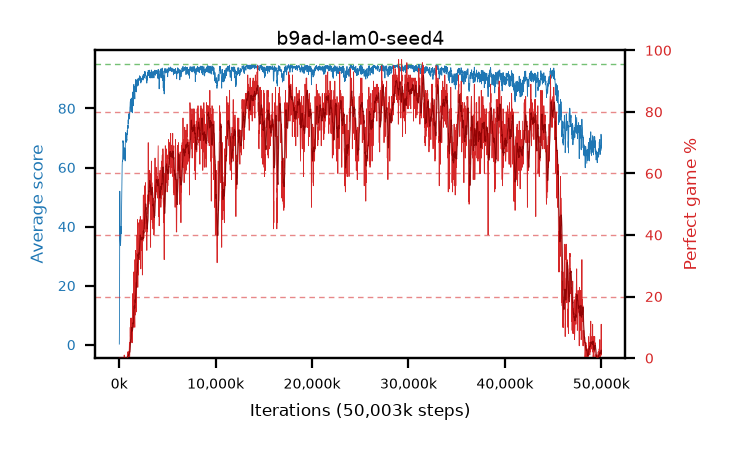

# b9ad-lam0-seed4

step **50,003,968** · 3052 evals · trailing **65.8** · peak **94.3** @28,999,680 · sef **29.9** · best30 **88.5** @29,016,064

## Config

| | |
|---|---|
| algo | ppo |
| collect_envs | 128 |
| discount | 0.99 |
| eval_interval | 16384 |
| eval_queue | True |
| eval_queue_depth | 16 |
| eval_workers | 8 |
| fc_layers | (320,) |
| graph_eval_episodes | 100 |
| max_steps | 50003968 |
| min_checkpoint_score | 40.0 |
| ppo_adam_epsilon | 1e-07 |
| ppo_clip | 0.2 |
| ppo_clip_final | None |
| ppo_entropy_coef | 0.01 |
| ppo_entropy_coef_final | None |
| ppo_epochs | 4 |
| ppo_gae_lambda | 0.0 |
| ppo_gradient_clipping | 0.5 |
| ppo_horizon | 1.0 |
| ppo_learning_rate | 0.0003 |
| ppo_learning_rate_final | None |
| ppo_minibatch | 256 |
| ppo_normalize_adv | True |
| ppo_rollout | 128 |
| ppo_target_kl | 0.0 |
| ppo_transitions_per_rollout | 16384 |
| ppo_value_loss | huber |
| ppo_vf_coef | 0.5 |
| seed | 4 |
| torch_threads | 1 |

## Evals

| step | avg score | trailing avg | min score | max score | avg reward | perfect % | epsilon |
|---|---|---|---|---|---|---|---|
| 16384 | 0.22 | 0.22 | 0.0 | 8.0 | -0.28 | 0.0 |  |
| 32768 | 7.59 | 3.9 | 0.0 | 22.0 | 7.09 | 0.0 |  |
| 49152 | 33.6 | 32.74 | 8.0 | 82.0 | 30.22 | 0.0 |  |
| ... | ... | ... | ... | ... | ... | ... | ... |
| 49823744 | 69.16 | 65.32 | 10.0 | 95.0 | 65.2 | 1.0 |  |
| 49840128 | 69.49 | 65.34 | 22.0 | 95.0 | 70.775 | 6.0 |  |
| 49856512 | 66.71 | 65.26 | 37.0 | 95.0 | 62.795 | 1.0 |  |
| 49872896 | 64.37 | 65.02 | 16.0 | 95.0 | 60.5 | 1.0 |  |
| 49889280 | 65.47 | 65.22 | 45.0 | 95.0 | 61.51 | 1.0 |  |
| 49905664 | 65.57 | 65.09 | 29.0 | 86.0 | 60.615 | 0.0 |  |
| 49922048 | 67.13 | 65.1 | 45.0 | 95.0 | 64.21 | 2.0 |  |
| 49938432 | 67.23 | 65.3 | 32.0 | 95.0 | 63.27 | 1.0 |  |
| 49954816 | 65.77 | 65.15 | 30.0 | 95.0 | 61.81 | 1.0 |  |
| 49971200 | 71.26 | 65.54 | 31.0 | 95.0 | 68.475 | 2.0 |  |
| 49987584 | 70.16 | 65.7 | 14.0 | 95.0 | 76.645 | 11.0 |  |
| 50003968 | 66.61 | 65.8 | 43.0 | 95.0 | 62.785 | 1.0 |  |
