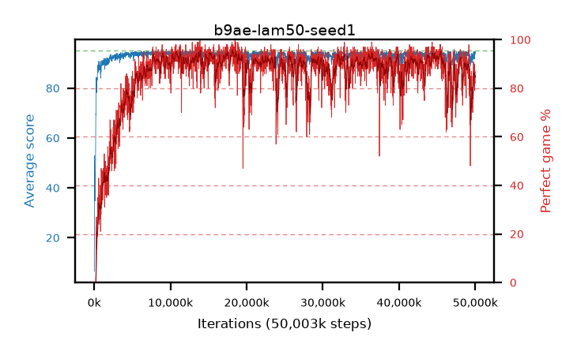

# b9ae-lam50-seed1

step **50,003,968** · 3052 evals · trailing **92.56** · peak **94.39** @11,567,104 · sef **82.7** · best30 **94.2** @18,464,768

## Config

| | |
|---|---|
| algo | ppo |
| collect_envs | 128 |
| discount | 0.99 |
| eval_interval | 16384 |
| eval_queue | True |
| eval_queue_depth | 16 |
| eval_workers | 8 |
| fc_layers | (320,) |
| graph_eval_episodes | 100 |
| max_steps | 50003968 |
| min_checkpoint_score | 40.0 |
| ppo_adam_epsilon | 1e-07 |
| ppo_clip | 0.2 |
| ppo_clip_final | None |
| ppo_entropy_coef | 0.01 |
| ppo_entropy_coef_final | None |
| ppo_epochs | 4 |
| ppo_gae_lambda | 0.5 |
| ppo_gradient_clipping | 0.5 |
| ppo_horizon | 2.0 |
| ppo_learning_rate | 0.0003 |
| ppo_learning_rate_final | None |
| ppo_minibatch | 256 |
| ppo_normalize_adv | True |
| ppo_rollout | 128 |
| ppo_target_kl | 0.0 |
| ppo_transitions_per_rollout | 16384 |
| ppo_value_loss | huber |
| ppo_vf_coef | 0.5 |
| seed | 1 |
| torch_threads | 1 |

## Evals

| step | avg score | trailing avg | min score | max score | avg reward | perfect % | epsilon |
|---|---|---|---|---|---|---|---|
| 16384 | 6.47 | 6.47 | 1.0 | 34.0 | 5.565 | 0.0 |  |
| 32768 | 27.52 | 22.92 | 0.0 | 64.0 | 24.095 | 0.0 |  |
| 49152 | 52.93 | 36.03 | 0.0 | 88.0 | 49.01 | 0.0 |  |
| ... | ... | ... | ... | ... | ... | ... | ... |
| 49823744 | 93.52 | 92.94 | 31.0 | 95.0 | 175.47 | 83.0 |  |
| 49840128 | 94.71 | 92.97 | 90.0 | 95.0 | 183.715 | 90.0 |  |
| 49856512 | 91.68 | 92.92 | 8.0 | 95.0 | 171.73 | 81.0 |  |
| 49872896 | 92.94 | 91.99 | 15.0 | 95.0 | 181.99 | 90.0 |  |
| 49889280 | 92.99 | 91.97 | 46.0 | 95.0 | 174.94 | 83.0 |  |
| 49905664 | 91.91 | 92.14 | 44.0 | 95.0 | 169.79 | 79.0 |  |
| 49922048 | 93.51 | 92.25 | 58.0 | 95.0 | 178.445 | 86.0 |  |
| 49938432 | 94.54 | 92.88 | 89.0 | 95.0 | 179.43 | 86.0 |  |
| 49954816 | 94.27 | 92.93 | 66.0 | 95.0 | 179.205 | 86.0 |  |
| 49971200 | 94.64 | 92.4 | 90.0 | 95.0 | 180.615 | 87.0 |  |
| 49987584 | 93.76 | 92.63 | 49.0 | 95.0 | 177.61 | 85.0 |  |
| 50003968 | 93.58 | 92.56 | 59.0 | 95.0 | 174.49 | 82.0 |  |
