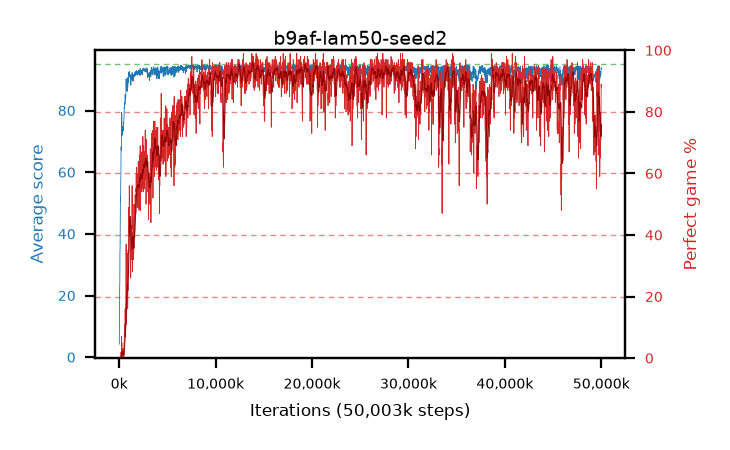

# b9af-lam50-seed2

step **50,003,968** · 3052 evals · trailing **92.15** · peak **94.4** @7,667,712 · sef **78.1** · best30 **94.2** @13,959,168

## Config

| | |
|---|---|
| algo | ppo |
| collect_envs | 128 |
| discount | 0.99 |
| eval_interval | 16384 |
| eval_queue | True |
| eval_queue_depth | 16 |
| eval_workers | 8 |
| fc_layers | (320,) |
| graph_eval_episodes | 100 |
| max_steps | 50003968 |
| min_checkpoint_score | 40.0 |
| ppo_adam_epsilon | 1e-07 |
| ppo_clip | 0.2 |
| ppo_clip_final | None |
| ppo_entropy_coef | 0.01 |
| ppo_entropy_coef_final | None |
| ppo_epochs | 4 |
| ppo_gae_lambda | 0.5 |
| ppo_gradient_clipping | 0.5 |
| ppo_horizon | 2.0 |
| ppo_learning_rate | 0.0003 |
| ppo_learning_rate_final | None |
| ppo_minibatch | 256 |
| ppo_normalize_adv | True |
| ppo_rollout | 128 |
| ppo_target_kl | 0.0 |
| ppo_transitions_per_rollout | 16384 |
| ppo_value_loss | huber |
| ppo_vf_coef | 0.5 |
| seed | 2 |
| torch_threads | 1 |

## Evals

| step | avg score | trailing avg | min score | max score | avg reward | perfect % | epsilon |
|---|---|---|---|---|---|---|---|
| 16384 | 4.25 | 4.25 | 0.0 | 9.0 | -0.57 | 0.0 |  |
| 32768 | 10.66 | 7.46 | 0.0 | 23.0 | 6.335 | 0.0 |  |
| 49152 | 22.45 | 21.99 | 0.0 | 44.0 | 18.215 | 0.0 |  |
| ... | ... | ... | ... | ... | ... | ... | ... |
| 49823744 | 92.9 | 91.88 | 58.0 | 95.0 | 174.805 | 83.0 |  |
| 49840128 | 90.19 | 91.69 | 70.0 | 95.0 | 148.35 | 59.0 |  |
| 49856512 | 91.22 | 91.93 | 72.0 | 95.0 | 159.33 | 69.0 |  |
| 49872896 | 90.99 | 91.93 | 53.0 | 95.0 | 161.135 | 71.0 |  |
| 49889280 | 91.15 | 92.04 | 56.0 | 95.0 | 155.28 | 65.0 |  |
| 49905664 | 91.84 | 92.04 | 52.0 | 95.0 | 163.885 | 73.0 |  |
| 49922048 | 92.71 | 92.06 | 12.0 | 95.0 | 170.635 | 79.0 |  |
| 49938432 | 91.47 | 92.04 | 46.0 | 95.0 | 166.41 | 76.0 |  |
| 49954816 | 91.81 | 92.18 | 18.0 | 95.0 | 161.775 | 71.0 |  |
| 49971200 | 92.34 | 92.14 | 46.0 | 95.0 | 169.225 | 78.0 |  |
| 49987584 | 93.9 | 92.33 | 43.0 | 95.0 | 181.91 | 89.0 |  |
| 50003968 | 93.57 | 92.15 | 45.0 | 95.0 | 180.495 | 88.0 |  |
