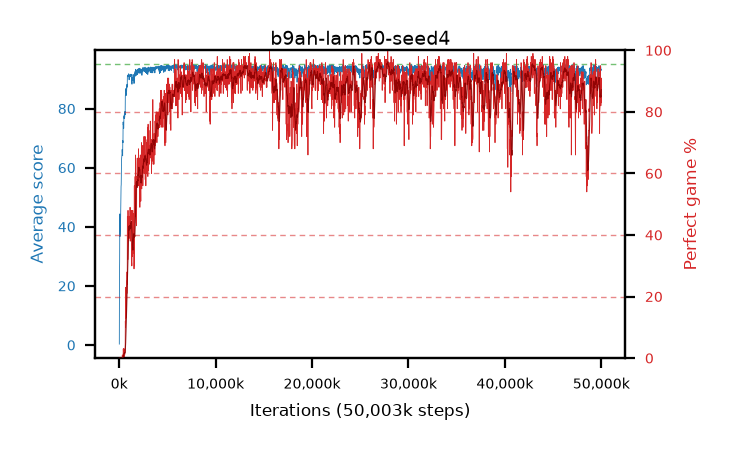

# b9ah-lam50-seed4

step **50,003,968** · 3052 evals · trailing **93.26** · peak **94.38** @13,385,728 · sef **82.9** · best30 **94.9** @27,131,904

## Config

| | |
|---|---|
| algo | ppo |
| collect_envs | 128 |
| discount | 0.99 |
| eval_interval | 16384 |
| eval_queue | True |
| eval_queue_depth | 16 |
| eval_workers | 8 |
| fc_layers | (320,) |
| graph_eval_episodes | 100 |
| max_steps | 50003968 |
| min_checkpoint_score | 40.0 |
| ppo_adam_epsilon | 1e-07 |
| ppo_clip | 0.2 |
| ppo_clip_final | None |
| ppo_entropy_coef | 0.01 |
| ppo_entropy_coef_final | None |
| ppo_epochs | 4 |
| ppo_gae_lambda | 0.5 |
| ppo_gradient_clipping | 0.5 |
| ppo_horizon | 2.0 |
| ppo_learning_rate | 0.0003 |
| ppo_learning_rate_final | None |
| ppo_minibatch | 256 |
| ppo_normalize_adv | True |
| ppo_rollout | 128 |
| ppo_target_kl | 0.0 |
| ppo_transitions_per_rollout | 16384 |
| ppo_value_loss | huber |
| ppo_vf_coef | 0.5 |
| seed | 4 |
| torch_threads | 1 |

## Evals

| step | avg score | trailing avg | min score | max score | avg reward | perfect % | epsilon |
|---|---|---|---|---|---|---|---|
| 16384 | 0.3 | 0.3 | 0.0 | 4.0 | -1.01 | 0.0 |  |
| 32768 | 23.19 | 11.75 | 0.0 | 48.0 | 18.865 | 0.0 |  |
| 49152 | 28.27 | 17.25 | 0.0 | 51.0 | 23.63 | 0.0 |  |
| ... | ... | ... | ... | ... | ... | ... | ... |
| 49823744 | 91.15 | 93.36 | 24.0 | 95.0 | 163.105 | 73.0 |  |
| 49840128 | 92.51 | 93.35 | 8.0 | 95.0 | 171.475 | 80.0 |  |
| 49856512 | 92.98 | 93.33 | 48.0 | 95.0 | 172.895 | 81.0 |  |
| 49872896 | 93.77 | 93.41 | 75.0 | 95.0 | 174.68 | 82.0 |  |
| 49889280 | 94.35 | 93.46 | 56.0 | 95.0 | 188.285 | 95.0 |  |
| 49905664 | 94.48 | 93.32 | 62.0 | 95.0 | 188.37 | 95.0 |  |
| 49922048 | 93.61 | 93.29 | 17.0 | 95.0 | 181.62 | 89.0 |  |
| 49938432 | 94.23 | 93.33 | 79.0 | 95.0 | 182.105 | 89.0 |  |
| 49954816 | 92.8 | 93.28 | 70.0 | 95.0 | 173.71 | 82.0 |  |
| 49971200 | 93.01 | 93.29 | 66.0 | 95.0 | 177.085 | 85.0 |  |
| 49987584 | 93.21 | 93.29 | 55.0 | 95.0 | 183.255 | 91.0 |  |
| 50003968 | 93.34 | 93.26 | 65.0 | 95.0 | 175.29 | 83.0 |  |
