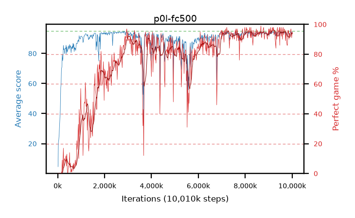

# p0l-fc500

step **10,010,624** · 611 evals · trailing **93.57** · peak **93.99** @2,768,896 · sef **63.0** · best30 **94.7** @9,207,808

## Config

| | |
|---|---|
| algo | ppo |
| collect_envs | 128 |
| discount | 0.99 |
| eval_interval | 16384 |
| eval_queue | True |
| eval_queue_depth | 16 |
| eval_workers | 6 |
| fc_layers | (500,) |
| graph_eval_episodes | 100 |
| max_steps | 10000000 |
| min_checkpoint_score | 40.0 |
| ppo_adam_epsilon | 1e-07 |
| ppo_clip | 0.2 |
| ppo_entropy_coef | 0.01 |
| ppo_entropy_coef_final | None |
| ppo_epochs | 4 |
| ppo_gae_lambda | 0.98 |
| ppo_gradient_clipping | 0.5 |
| ppo_horizon | 33.6 |
| ppo_learning_rate | 0.0003 |
| ppo_minibatch | 256 |
| ppo_normalize_adv | True |
| ppo_rollout | 128 |
| ppo_target_kl | 0.0 |
| ppo_transitions_per_rollout | 16384 |
| ppo_value_loss | huber |
| ppo_vf_coef | 0.5 |
| seed | 1 |
| torch_threads | 1 |

## Evals

| step | avg score | trailing avg | min score | max score | avg reward | perfect % | epsilon |
|---|---|---|---|---|---|---|---|
| 16384 | 4.66 | 4.66 | 0.0 | 13.0 | -0.115 | 0.0 |  |
| 32768 | 20.9 | 12.78 | 3.0 | 41.0 | 15.9 | 0.0 |  |
| 49152 | 22.91 | 16.16 | 7.0 | 41.0 | 17.91 | 0.0 |  |
| ... | ... | ... | ... | ... | ... | ... | ... |
| 9830400 | 93.98 | 93.53 | 64.0 | 95.0 | 186.965 | 94.0 |  |
| 9846784 | 94.15 | 93.49 | 66.0 | 95.0 | 189.17 | 96.0 |  |
| 9863168 | 92.94 | 93.64 | 61.0 | 95.0 | 181.99 | 90.0 |  |
| 9879552 | 93.31 | 93.63 | 12.0 | 95.0 | 186.34 | 94.0 |  |
| 9895936 | 92.42 | 93.61 | 8.0 | 95.0 | 183.46 | 92.0 |  |
| 9912320 | 93.95 | 93.59 | 71.0 | 95.0 | 186.935 | 94.0 |  |
| 9928704 | 94.03 | 93.62 | 58.0 | 95.0 | 188.01 | 95.0 |  |
| 9945088 | 94.64 | 93.66 | 70.0 | 95.0 | 190.655 | 97.0 |  |
| 9961472 | 93.78 | 93.57 | 18.0 | 95.0 | 187.76 | 95.0 |  |
| 9977856 | 92.63 | 93.52 | 42.0 | 95.0 | 182.675 | 91.0 |  |
| 9994240 | 94.43 | 93.58 | 71.0 | 95.0 | 188.455 | 95.0 |  |
| 10010624 | 94.0 | 93.57 | 59.0 | 95.0 | 186.985 | 94.0 |  |
