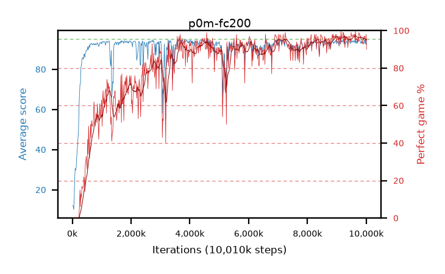

# p0m-fc200

step **10,010,624** · 611 evals · trailing **93.65** · peak **94.08** @4,063,232 · sef **69.6** · best30 **96.4** @9,961,472

## Config

| | |
|---|---|
| algo | ppo |
| collect_envs | 128 |
| discount | 0.99 |
| eval_interval | 16384 |
| eval_queue | True |
| eval_queue_depth | 16 |
| eval_workers | 6 |
| fc_layers | (200,) |
| graph_eval_episodes | 100 |
| max_steps | 10000000 |
| min_checkpoint_score | 40.0 |
| ppo_adam_epsilon | 1e-07 |
| ppo_clip | 0.2 |
| ppo_entropy_coef | 0.01 |
| ppo_entropy_coef_final | None |
| ppo_epochs | 4 |
| ppo_gae_lambda | 0.98 |
| ppo_gradient_clipping | 0.5 |
| ppo_horizon | 33.6 |
| ppo_learning_rate | 0.0003 |
| ppo_minibatch | 256 |
| ppo_normalize_adv | True |
| ppo_rollout | 128 |
| ppo_target_kl | 0.0 |
| ppo_transitions_per_rollout | 16384 |
| ppo_value_loss | huber |
| ppo_vf_coef | 0.5 |
| seed | 1 |
| torch_threads | 1 |

## Evals

| step | avg score | trailing avg | min score | max score | avg reward | perfect % | epsilon |
|---|---|---|---|---|---|---|---|
| 16384 | 12.25 | 12.25 | 0.0 | 23.0 | 9.5 | 0.0 |  |
| 32768 | 11.83 | 11.41 | 2.0 | 26.0 | 6.965 | 0.0 |  |
| 49152 | 10.16 | 11.21 | 1.0 | 23.0 | 6.195 | 0.0 |  |
| ... | ... | ... | ... | ... | ... | ... | ... |
| 9830400 | 93.74 | 93.75 | 58.0 | 95.0 | 188.76 | 96.0 |  |
| 9846784 | 93.16 | 93.76 | 26.0 | 95.0 | 187.185 | 95.0 |  |
| 9863168 | 93.06 | 93.79 | 39.0 | 95.0 | 185.095 | 93.0 |  |
| 9879552 | 93.14 | 93.79 | 32.0 | 95.0 | 187.165 | 95.0 |  |
| 9895936 | 93.5 | 93.75 | 51.0 | 95.0 | 188.52 | 96.0 |  |
| 9912320 | 92.53 | 93.69 | 14.0 | 95.0 | 186.555 | 95.0 |  |
| 9928704 | 94.62 | 93.72 | 79.0 | 95.0 | 190.59 | 97.0 |  |
| 9945088 | 94.13 | 93.77 | 54.0 | 95.0 | 190.145 | 97.0 |  |
| 9961472 | 92.8 | 93.75 | 14.0 | 95.0 | 186.825 | 95.0 |  |
| 9977856 | 92.68 | 93.69 | 44.0 | 95.0 | 185.71 | 94.0 |  |
| 9994240 | 94.27 | 93.71 | 58.0 | 95.0 | 191.28 | 98.0 |  |
| 10010624 | 92.11 | 93.65 | 49.0 | 95.0 | 181.16 | 90.0 |  |
