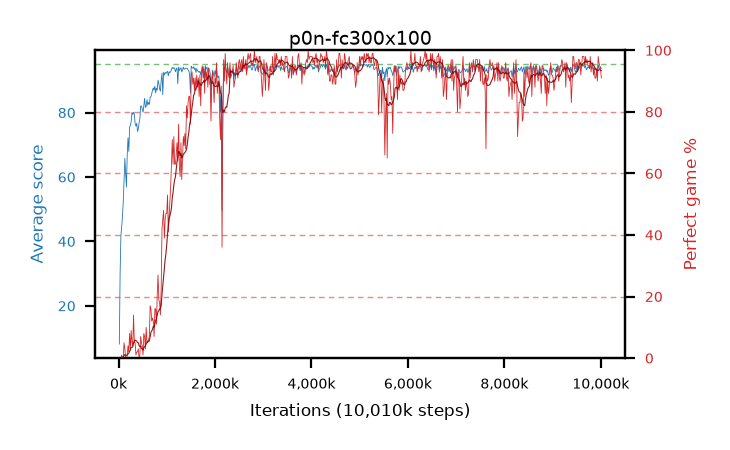

# p0n-fc300x100

step **10,010,624** · 611 evals · trailing **93.97** · peak **94.29** @5,095,424 · sef **83.3** · best30 **96.9** @4,358,144

## Config

| | |
|---|---|
| algo | ppo |
| collect_envs | 128 |
| discount | 0.99 |
| eval_interval | 16384 |
| eval_queue | True |
| eval_queue_depth | 16 |
| eval_workers | 6 |
| fc_layers | (300, 100) |
| graph_eval_episodes | 100 |
| max_steps | 10000000 |
| min_checkpoint_score | 40.0 |
| ppo_adam_epsilon | 1e-07 |
| ppo_clip | 0.2 |
| ppo_entropy_coef | 0.01 |
| ppo_entropy_coef_final | None |
| ppo_epochs | 4 |
| ppo_gae_lambda | 0.98 |
| ppo_gradient_clipping | 0.5 |
| ppo_horizon | 33.6 |
| ppo_learning_rate | 0.0003 |
| ppo_minibatch | 256 |
| ppo_normalize_adv | True |
| ppo_rollout | 128 |
| ppo_target_kl | 0.0 |
| ppo_transitions_per_rollout | 16384 |
| ppo_value_loss | huber |
| ppo_vf_coef | 0.5 |
| seed | 1 |
| torch_threads | 1 |

## Evals

| step | avg score | trailing avg | min score | max score | avg reward | perfect % | epsilon |
|---|---|---|---|---|---|---|---|
| 16384 | 8.13 | 19.09 | 0.0 | 28.0 | 6.505 | 0.0 |  |
| 32768 | 30.06 | 30.06 | 1.0 | 65.0 | 25.465 | 0.0 |  |
| 49152 | 41.81 | 26.67 | 10.0 | 90.0 | 36.81 | 0.0 |  |
| ... | ... | ... | ... | ... | ... | ... | ... |
| 9830400 | 94.14 | 93.94 | 60.0 | 95.0 | 189.16 | 96.0 |  |
| 9846784 | 92.98 | 93.93 | 52.0 | 95.0 | 184.02 | 92.0 |  |
| 9863168 | 94.12 | 93.93 | 61.0 | 95.0 | 187.15 | 94.0 |  |
| 9879552 | 93.15 | 93.94 | 34.0 | 95.0 | 183.195 | 91.0 |  |
| 9895936 | 93.57 | 93.93 | 63.0 | 95.0 | 183.615 | 91.0 |  |
| 9912320 | 92.92 | 93.89 | 10.0 | 95.0 | 185.95 | 94.0 |  |
| 9928704 | 92.72 | 93.93 | 12.0 | 95.0 | 181.725 | 90.0 |  |
| 9945088 | 94.86 | 93.98 | 87.0 | 95.0 | 191.87 | 98.0 |  |
| 9961472 | 93.82 | 93.9 | 20.0 | 95.0 | 188.84 | 96.0 |  |
| 9977856 | 93.57 | 93.93 | 38.0 | 95.0 | 187.55 | 95.0 |  |
| 9994240 | 94.17 | 93.97 | 66.0 | 95.0 | 187.2 | 94.0 |  |
| 10010624 | 93.81 | 93.97 | 65.0 | 95.0 | 183.855 | 91.0 |  |
