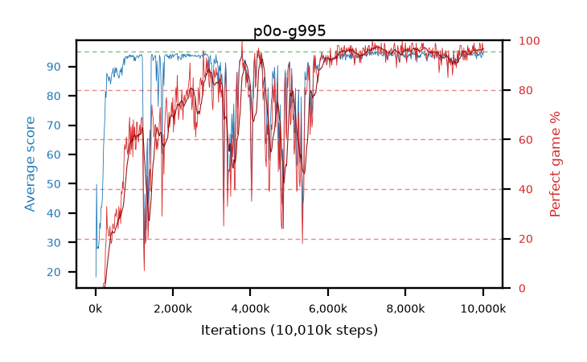

# p0o-g995

step **10,010,624** · 611 evals · trailing **93.89** · peak **94.3** @7,028,736 · sef **58.8** · best30 **96.7** @7,372,800

## Config

| | |
|---|---|
| algo | ppo |
| collect_envs | 128 |
| discount | 0.995 |
| eval_interval | 16384 |
| eval_queue | True |
| eval_queue_depth | 16 |
| eval_workers | 6 |
| fc_layers | (320,) |
| graph_eval_episodes | 100 |
| max_steps | 10000000 |
| min_checkpoint_score | 40.0 |
| ppo_adam_epsilon | 1e-07 |
| ppo_clip | 0.2 |
| ppo_entropy_coef | 0.01 |
| ppo_entropy_coef_final | None |
| ppo_epochs | 4 |
| ppo_gae_lambda | 0.98 |
| ppo_gradient_clipping | 0.5 |
| ppo_horizon | 40.2 |
| ppo_learning_rate | 0.0003 |
| ppo_minibatch | 256 |
| ppo_normalize_adv | True |
| ppo_rollout | 128 |
| ppo_target_kl | 0.0 |
| ppo_transitions_per_rollout | 16384 |
| ppo_value_loss | huber |
| ppo_vf_coef | 0.5 |
| seed | 1 |
| torch_threads | 1 |

## Evals

| step | avg score | trailing avg | min score | max score | avg reward | perfect % | epsilon |
|---|---|---|---|---|---|---|---|
| 16384 | 18.29 | 23.1 | 3.0 | 41.0 | 15.045 | 0.0 |  |
| 32768 | 49.83 | 31.84 | 4.0 | 86.0 | 45.145 | 0.0 |  |
| 49152 | 27.91 | 27.91 | 8.0 | 44.0 | 22.955 | 0.0 |  |
| ... | ... | ... | ... | ... | ... | ... | ... |
| 9830400 | 92.59 | 93.59 | 14.0 | 95.0 | 186.57 | 95.0 |  |
| 9846784 | 94.6 | 93.87 | 73.0 | 95.0 | 189.62 | 96.0 |  |
| 9863168 | 93.6 | 93.83 | 24.0 | 95.0 | 188.575 | 96.0 |  |
| 9879552 | 94.23 | 93.88 | 67.0 | 95.0 | 189.25 | 96.0 |  |
| 9895936 | 93.65 | 93.57 | 40.0 | 95.0 | 188.625 | 96.0 |  |
| 9912320 | 94.8 | 93.79 | 75.0 | 95.0 | 192.805 | 99.0 |  |
| 9928704 | 94.63 | 93.82 | 67.0 | 95.0 | 191.64 | 98.0 |  |
| 9945088 | 92.99 | 93.86 | 18.0 | 95.0 | 187.015 | 95.0 |  |
| 9961472 | 93.11 | 93.85 | 10.0 | 95.0 | 187.135 | 95.0 |  |
| 9977856 | 94.81 | 93.91 | 76.0 | 95.0 | 192.815 | 99.0 |  |
| 9994240 | 94.17 | 93.91 | 58.0 | 95.0 | 190.185 | 97.0 |  |
| 10010624 | 93.95 | 93.89 | 68.0 | 95.0 | 187.975 | 95.0 |  |
