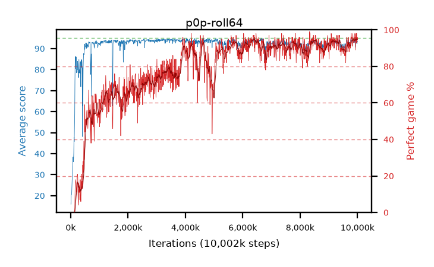

# p0p-roll64

step **10,002,432** · 1221 evals · trailing **93.42** · peak **94.09** @3,293,184 · sef **60.3** · best30 **94.8** @10,002,432

## Config

| | |
|---|---|
| algo | ppo |
| collect_envs | 128 |
| discount | 0.99 |
| eval_interval | 8192 |
| eval_queue | True |
| eval_queue_depth | 16 |
| eval_workers | 6 |
| fc_layers | (320,) |
| graph_eval_episodes | 100 |
| max_steps | 10000000 |
| min_checkpoint_score | 40.0 |
| ppo_adam_epsilon | 1e-07 |
| ppo_clip | 0.2 |
| ppo_entropy_coef | 0.01 |
| ppo_entropy_coef_final | None |
| ppo_epochs | 4 |
| ppo_gae_lambda | 0.98 |
| ppo_gradient_clipping | 0.5 |
| ppo_horizon | 33.6 |
| ppo_learning_rate | 0.0003 |
| ppo_minibatch | 256 |
| ppo_normalize_adv | True |
| ppo_rollout | 64 |
| ppo_target_kl | 0.0 |
| ppo_transitions_per_rollout | 8192 |
| ppo_value_loss | huber |
| ppo_vf_coef | 0.5 |
| seed | 1 |
| torch_threads | 1 |

## Evals

| step | avg score | trailing avg | min score | max score | avg reward | perfect % | epsilon |
|---|---|---|---|---|---|---|---|
| 8192 | 15.95 | 21.1 | 5.0 | 29.0 | 11.67 | 0.0 |  |
| 16384 | 20.25 | 20.25 | 1.0 | 39.0 | 15.34 | 0.0 |  |
| 24576 | 20.43 | 20.34 | 1.0 | 42.0 | 15.52 | 0.0 |  |
| ... | ... | ... | ... | ... | ... | ... | ... |
| 9912320 | 94.36 | 93.26 | 60.0 | 95.0 | 191.37 | 98.0 |  |
| 9920512 | 93.62 | 93.36 | 53.0 | 95.0 | 187.6 | 95.0 |  |
| 9928704 | 93.89 | 93.35 | 46.0 | 95.0 | 188.91 | 96.0 |  |
| 9936896 | 90.63 | 93.29 | 20.0 | 95.0 | 178.685 | 89.0 |  |
| 9945088 | 92.53 | 93.3 | 24.0 | 95.0 | 185.56 | 94.0 |  |
| 9953280 | 94.3 | 93.36 | 53.0 | 95.0 | 191.31 | 98.0 |  |
| 9961472 | 92.67 | 93.28 | 51.0 | 95.0 | 184.705 | 93.0 |  |
| 9969664 | 94.45 | 93.42 | 67.0 | 95.0 | 191.46 | 98.0 |  |
| 9977856 | 92.48 | 93.3 | 12.0 | 95.0 | 186.505 | 95.0 |  |
| 9986048 | 92.3 | 93.41 | 47.0 | 95.0 | 184.335 | 93.0 |  |
| 9994240 | 93.48 | 93.46 | 28.0 | 95.0 | 188.5 | 96.0 |  |
| 10002432 | 93.28 | 93.42 | 43.0 | 95.0 | 187.305 | 95.0 |  |
