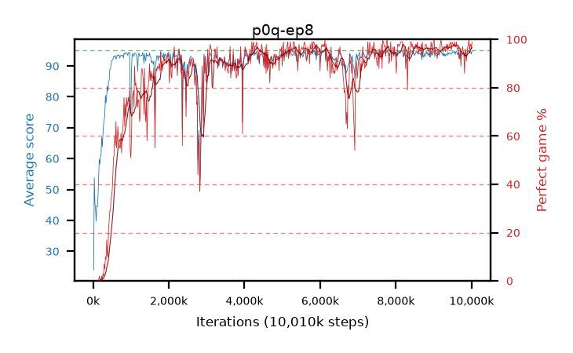

# p0q-ep8

step **10,010,624** · 611 evals · trailing **94.04** · peak **94.15** @8,208,384 · sef **82.5** · best30 **97.2** @9,650,176

## Config

| | |
|---|---|
| algo | ppo |
| collect_envs | 128 |
| discount | 0.99 |
| eval_interval | 16384 |
| eval_queue | True |
| eval_queue_depth | 16 |
| eval_workers | 6 |
| fc_layers | (320,) |
| graph_eval_episodes | 100 |
| max_steps | 10000000 |
| min_checkpoint_score | 40.0 |
| ppo_adam_epsilon | 1e-07 |
| ppo_clip | 0.2 |
| ppo_entropy_coef | 0.01 |
| ppo_entropy_coef_final | None |
| ppo_epochs | 8 |
| ppo_gae_lambda | 0.98 |
| ppo_gradient_clipping | 0.5 |
| ppo_horizon | 33.6 |
| ppo_learning_rate | 0.0003 |
| ppo_minibatch | 256 |
| ppo_normalize_adv | True |
| ppo_rollout | 128 |
| ppo_target_kl | 0.0 |
| ppo_transitions_per_rollout | 16384 |
| ppo_value_loss | huber |
| ppo_vf_coef | 0.5 |
| seed | 1 |
| torch_threads | 1 |

## Evals

| step | avg score | trailing avg | min score | max score | avg reward | perfect % | epsilon |
|---|---|---|---|---|---|---|---|
| 16384 | 23.97 | 23.97 | 1.0 | 44.0 | 20.545 | 0.0 |  |
| 32768 | 53.83 | 41.4 | 21.0 | 78.0 | 49.685 | 0.0 |  |
| 49152 | 45.67 | 34.82 | 17.0 | 72.0 | 40.985 | 0.0 |  |
| ... | ... | ... | ... | ... | ... | ... | ... |
| 9830400 | 94.25 | 94.0 | 62.0 | 95.0 | 189.27 | 96.0 |  |
| 9846784 | 94.04 | 94.01 | 42.0 | 95.0 | 188.065 | 95.0 |  |
| 9863168 | 92.93 | 93.95 | 39.0 | 95.0 | 182.885 | 91.0 |  |
| 9879552 | 93.89 | 94.0 | 35.0 | 95.0 | 186.875 | 94.0 |  |
| 9895936 | 94.39 | 94.0 | 64.0 | 95.0 | 190.405 | 97.0 |  |
| 9912320 | 94.78 | 94.04 | 76.0 | 95.0 | 191.79 | 98.0 |  |
| 9928704 | 95.0 | 93.99 | 95.0 | 95.0 | 194.0 | 100.0 |  |
| 9945088 | 94.22 | 94.06 | 55.0 | 95.0 | 188.2 | 95.0 |  |
| 9961472 | 94.7 | 94.06 | 78.0 | 95.0 | 191.71 | 98.0 |  |
| 9977856 | 94.6 | 94.01 | 67.0 | 95.0 | 191.61 | 98.0 |  |
| 9994240 | 93.83 | 94.03 | 37.0 | 95.0 | 188.805 | 96.0 |  |
| 10010624 | 94.8 | 94.04 | 75.0 | 95.0 | 192.805 | 99.0 |  |
