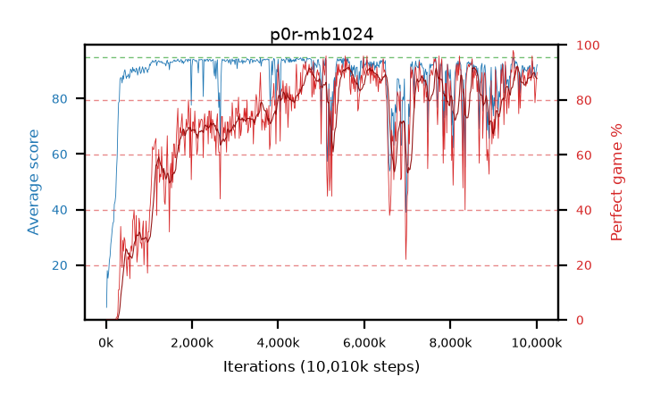

# p0r-mb1024

step **10,010,624** · 611 evals · trailing **89.95** · peak **93.93** @4,587,520 · sef **46.0** · best30 **89.7** @6,438,912

## Config

| | |
|---|---|
| algo | ppo |
| collect_envs | 128 |
| discount | 0.99 |
| eval_interval | 16384 |
| eval_queue | True |
| eval_queue_depth | 16 |
| eval_workers | 6 |
| fc_layers | (320,) |
| graph_eval_episodes | 100 |
| max_steps | 10000000 |
| min_checkpoint_score | 40.0 |
| ppo_adam_epsilon | 1e-07 |
| ppo_clip | 0.2 |
| ppo_entropy_coef | 0.01 |
| ppo_entropy_coef_final | None |
| ppo_epochs | 4 |
| ppo_gae_lambda | 0.98 |
| ppo_gradient_clipping | 0.5 |
| ppo_horizon | 33.6 |
| ppo_learning_rate | 0.0003 |
| ppo_minibatch | 1024 |
| ppo_normalize_adv | True |
| ppo_rollout | 128 |
| ppo_target_kl | 0.0 |
| ppo_transitions_per_rollout | 16384 |
| ppo_value_loss | huber |
| ppo_vf_coef | 0.5 |
| seed | 1 |
| torch_threads | 1 |

## Evals

| step | avg score | trailing avg | min score | max score | avg reward | perfect % | epsilon |
|---|---|---|---|---|---|---|---|
| 16384 | 4.74 | 4.74 | 1.0 | 18.0 | 4.105 | 0.0 |  |
| 32768 | 18.01 | 11.38 | 4.0 | 37.0 | 13.055 | 0.0 |  |
| 49152 | 15.3 | 12.68 | 3.0 | 30.0 | 10.3 | 0.0 |  |
| ... | ... | ... | ... | ... | ... | ... | ... |
| 9830400 | 91.7 | 89.68 | 37.0 | 95.0 | 181.745 | 91.0 |  |
| 9846784 | 91.91 | 90.57 | 41.0 | 95.0 | 182.95 | 92.0 |  |
| 9863168 | 89.5 | 90.36 | 35.0 | 95.0 | 175.565 | 87.0 |  |
| 9879552 | 88.38 | 90.37 | 6.0 | 95.0 | 175.44 | 88.0 |  |
| 9895936 | 93.58 | 90.58 | 43.0 | 95.0 | 188.6 | 96.0 |  |
| 9912320 | 91.79 | 90.17 | 52.0 | 95.0 | 181.835 | 91.0 |  |
| 9928704 | 90.66 | 90.16 | 6.0 | 95.0 | 177.72 | 88.0 |  |
| 9945088 | 91.33 | 90.25 | 37.0 | 95.0 | 178.39 | 88.0 |  |
| 9961472 | 87.87 | 89.97 | 37.0 | 95.0 | 165.975 | 79.0 |  |
| 9977856 | 88.98 | 90.45 | 12.0 | 95.0 | 171.065 | 83.0 |  |
| 9994240 | 90.5 | 90.36 | 43.0 | 95.0 | 177.56 | 88.0 |  |
| 10010624 | 92.21 | 89.95 | 53.0 | 95.0 | 181.26 | 90.0 |  |
