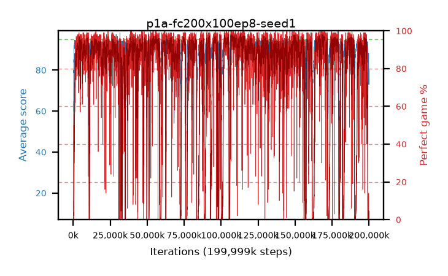

# p1a-fc200x100ep8-seed1

step **199,999,488** · 12207 evals · trailing **81.28** · peak **94.66** @107,249,664 · sef **76.8** · best30 **97.4** @169,017,344

## Config

| | |
|---|---|
| algo | ppo |
| collect_envs | 128 |
| discount | 0.99 |
| eval_interval | 16384 |
| eval_queue | True |
| eval_queue_depth | 16 |
| eval_workers | 8 |
| fc_layers | (200, 100) |
| graph_eval_episodes | 100 |
| max_steps | 199999488 |
| min_checkpoint_score | 40.0 |
| ppo_adam_epsilon | 1e-07 |
| ppo_clip | 0.2 |
| ppo_entropy_coef | 0.01 |
| ppo_entropy_coef_final | None |
| ppo_epochs | 8 |
| ppo_gae_lambda | 0.98 |
| ppo_gradient_clipping | 0.5 |
| ppo_horizon | 33.6 |
| ppo_learning_rate | 0.0003 |
| ppo_minibatch | 256 |
| ppo_normalize_adv | True |
| ppo_rollout | 128 |
| ppo_target_kl | 0.0 |
| ppo_transitions_per_rollout | 16384 |
| ppo_value_loss | huber |
| ppo_vf_coef | 0.5 |
| seed | 1 |
| torch_threads | 1 |

## Evals

| step | avg score | trailing avg | min score | max score | avg reward | perfect % | epsilon |
|---|---|---|---|---|---|---|---|
| 16384 | 11.2 | 11.2 | 2.0 | 21.0 | 6.695 | 0.0 |  |
| 32768 | 37.1 | 32.03 | 0.0 | 62.0 | 32.46 | 0.0 |  |
| 49152 | 38.92 | 25.06 | 1.0 | 66.0 | 34.1 | 0.0 |  |
| ... | ... | ... | ... | ... | ... | ... | ... |
| 199819264 | 73.41 | 80.96 | 21.0 | 86.0 | 68.41 | 0.0 |  |
| 199835648 | 77.43 | 81.17 | 63.0 | 85.0 | 72.43 | 0.0 |  |
| 199852032 | 77.84 | 80.57 | 66.0 | 85.0 | 72.84 | 0.0 |  |
| 199868416 | 77.74 | 80.99 | 8.0 | 88.0 | 72.74 | 0.0 |  |
| 199884800 | 73.36 | 80.94 | 61.0 | 84.0 | 68.36 | 0.0 |  |
| 199901184 | 72.98 | 80.24 | 58.0 | 82.0 | 67.98 | 0.0 |  |
| 199917568 | 75.34 | 80.79 | 61.0 | 85.0 | 70.34 | 0.0 |  |
| 199933952 | 77.26 | 81.0 | 66.0 | 85.0 | 72.26 | 0.0 |  |
| 199950336 | 79.13 | 81.15 | 32.0 | 87.0 | 74.13 | 0.0 |  |
| 199966720 | 79.14 | 81.27 | 63.0 | 87.0 | 74.14 | 0.0 |  |
| 199983104 | 78.13 | 81.27 | 6.0 | 85.0 | 73.13 | 0.0 |  |
| 199999488 | 80.05 | 81.28 | 61.0 | 89.0 | 75.05 | 0.0 |  |
